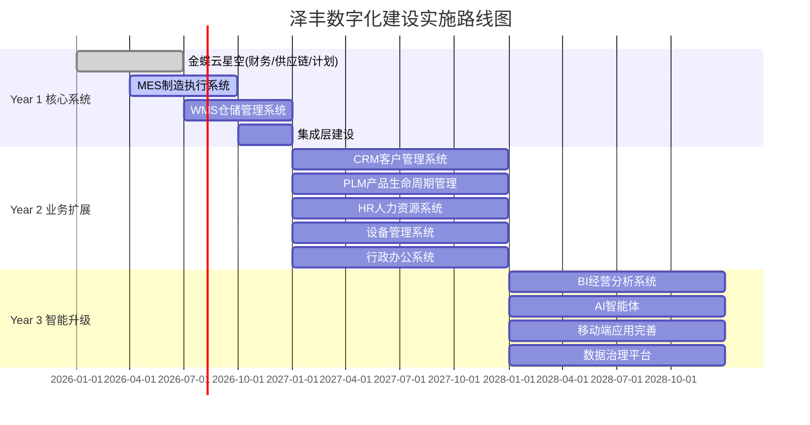

# 技术需求文档(TRD)

**文档版本：** v1.0
**创建日期：** 2026-03-24
**项目名称：** 泽丰数字化建设技术选型及架构建议方案
**状态：** 待确认

---

## 目录

1. [项目概述](#一项目概述)
2. [技术架构设计](#二技术架构设计)
3. [系统边界划分](#三系统边界划分)
4. [集成层设计](#四集成层设计)
5. [核心业务流程](#五核心业务流程)
6. [功能需求清单](#六功能需求清单)
7. [非功能需求](#七非功能需求)
8. [分期实施规划](#八分期实施规划)
9. [约束条件](#九约束条件)
10. [待确认事项](#十待确认事项)
11. [技术风险评估](#十一技术风险评估)

---

## 一、项目概述

### 1.1 项目背景

| 项目 | 内容 |
|-----|------|
| 客户名称 | 泽丰 |
| 行业领域 | 高价值半导体及设备生产制造 |
| 企业特点 | 高精度、高价值、高追溯要求 |
| 现有系统 | 用友U8财务模块（计划替换，不迁移数据） |

### 1.2 项目目标

为泽丰IT部门高管提供技术选型及架构设计决策支持，帮助客户明确：

- 技术底座选型与边界划分
- 双底座集成方案
- 整体架构设计
- 核心业务流程设计
- 分期实施规划

### 1.3 技术选型结论

| 技术底座 | 产品名称 | 定位 | 职责边界 |
|---------|---------|------|---------|
| ERP底座 | 金蝶云星空 | 企业核心业务管理 | 财务核算、供应链管理、生产计划、成本管理 |
| 开发底座 | 活字格 | 业务系统自研平台 | MES、WMS、CRM、PLM、HR、设备管理、行政、BI等 |

### 1.4 选型依据

| 维度 | 金蝶云星空 | 活字格 |
|------|-----------|--------|
| 成熟度 | 国内ERP头部产品，财务模块成熟可靠 | 低代码平台，快速开发迭代 |
| 扩展性 | 标准API接口，支持二次开发 | 灵活定制，满足个性化需求 |
| 成本 | 标准产品+实施，成本可控 | 自研降低长期license成本 |
| 行业适配 | 半导体行业有成功案例 | 可按需定制行业特性功能 |

---

## 二、技术架构设计

### 2.1 整体架构蓝图

采用**"双底座三层五域"**架构：

```
┌─────────────────────────────────────────────────────────────────┐
│                        展现层                                    │
│    PC端（活字格Web）  │  移动端（企业微信/钉钉）  │  大屏看板    │
├─────────────────────────────────────────────────────────────────┤
│                        业务层                                    │
│  ┌──────────────┐  ┌──────────────────────────────────────┐    │
│  │  金蝶云星空   │  │          活字格自研系统               │    │
│  │  (ERP核心)   │  │  CRM│HR│MES│WMS│PLM│设备│行政│BI    │    │
│  │ 财务│供应链  │  │                                      │    │
│  └──────────────┘  └──────────────────────────────────────┘    │
├─────────────────────────────────────────────────────────────────┤
│                        集成层                                    │
│     API网关  │  数据同步引擎  │  消息队列  │  统一认证          │
├─────────────────────────────────────────────────────────────────┤
│                        数据层                                    │
│     金蝶云数据库  │  活字格数据库  │  中间交换库  │  数据仓库    │
└─────────────────────────────────────────────────────────────────┘
```

### 2.2 五域划分

| 域 | 负责系统 | 核心职责 | 主导方 |
|----|---------|---------|--------|
| 财务域 | 金蝶主导 | 总账、应收应付、固定资产、成本核算 | 金蝶 |
| 供应链域 | 金蝶主导 | 采购、销售、库存、生产计划 | 金蝶 |
| 执行域 | 活字格主导 | MES制造执行、WMS仓储管理、设备管理 | 自研 |
| 研发域 | 活字格主导 | PLM产品生命周期、CRM客户管理 | 自研 |
| 管理域 | 活字格主导 | HR人力、行政办公、BI分析 | 自研 |

### 2.3 技术栈定义

| 层级 | 技术组件 | 说明 |
|-----|---------|------|
| 展现层 | 活字格Web、企业微信/钉钉、大屏 | 多端统一展现 |
| 业务层 | 金蝶云星空、活字格平台 | 双底座业务系统 |
| 集成层 | API网关、ETL工具、消息队列 | 数据交换与流程编排 |
| 数据层 | SQL Server、中间库、数据仓库 | 数据持久化与分析 |

---

## 三、系统边界划分

### 3.1 金蝶与活字格职责分工

| 业务领域 | 金蝶云星空负责 | 活字格自研负责 | 数据流向 |
|---------|--------------|--------------|---------|
| 财务 | 总账、应收、应付、固定资产、成本核算、报表 | 费用报销流程、预算编制 | 活字格→金蝶 |
| 供应链 | 采购订单、销售订单、库存主数据、MRP计算 | 供应商门户、客户门户、采购协同 | 双向同步 |
| 生产 | 生产计划、BOM管理、工艺路线 | MES执行、报工、质检、设备采集 | 活字格→金蝶 |
| 仓储 | 库存账务、调拨单据 | WMS作业、上架下架、盘点、条码 | 活字格→金蝶 |
| 销售 | 价格管理、信用控制 | CRM线索、商机、报价、合同 | 活字格→金蝶 |
| 研发 | 物料主数据 | PLM图文档、BOM版本、变更管理 | PLM→金蝶 |
| 人力 | 薪资核算、社保公积金 | HR招聘、培训、考勤、绩效 | 活字格→金蝶 |
| 分析 | 财务报表 | BI经营分析、AI智能体 | 金蝶→活字格 |

### 3.2 核心原则

1. **数据权威原则**：金蝶作为"数据权威"，所有涉及财务账务的操作以金蝶为准
2. **入口统一原则**：活字格作为"业务操作入口"，用户日常操作在活字格完成
3. **单据流转原则**：活字格发起→审批→同步金蝶→财务处理

---

## 四、集成层设计

### 4.1 集成架构

采用**混合模式**：核心业务API直连 + 批量数据中间库同步

```
┌────────────────────────────────────────────────────────────────┐
│                         集成层                                  │
│                                                                │
│  ┌─────────────┐    ┌─────────────┐    ┌─────────────┐       │
│  │  API网关    │    │ 数据同步引擎 │    │  消息队列   │       │
│  │ (统一入口)  │    │ (ETL调度)   │    │ (异步处理)  │       │
│  └─────────────┘    └─────────────┘    └─────────────┘       │
│         │                  │                  │               │
│         └──────────────────┼──────────────────┘               │
│                            ▼                                  │
│                    ┌─────────────┐                            │
│                    │  中间交换库  │                            │
│                    │ (数据缓冲)  │                            │
│                    └─────────────┘                            │
│                      ↙            ↘                           │
│            ┌─────────────┐  ┌─────────────┐                   │
│            │金蝶云数据库 │  │活字格数据库 │                   │
│            └─────────────┘  └─────────────┘                   │
└────────────────────────────────────────────────────────────────┘
```

### 4.2 API直连场景（实时业务）

| 接口编号 | 业务场景 | 触发条件 | 数据流向 | 实时性要求 | 优先级 |
|---------|---------|---------|---------|-----------|-------|
| API-001 | 销售订单同步 | CRM报价审批通过 | 活字格→金蝶 | 秒级 | P0 |
| API-002 | 库存变动同步 | WMS出入库完成 | 活字格→金蝶 | 秒级 | P0 |
| API-003 | 生产报工同步 | MES工序完成 | 活字格→金蝶 | 秒级 | P0 |
| API-004 | 凭证生成 | 业务单据审批完成 | 活字格→金蝶 | 秒级 | P0 |
| API-005 | 价格查询 | 订单创建时 | 金蝶→活字格 | 毫秒级 | P1 |
| API-006 | 信用查询 | 订单创建时 | 金蝶→活字格 | 毫秒级 | P1 |

### 4.3 中间库同步场景（批量业务）

| 同步编号 | 业务场景 | 同步频率 | 数据流向 | 说明 | 优先级 |
|---------|---------|---------|---------|------|-------|
| SYNC-001 | 物料主数据 | 每日凌晨 | 金蝶→活字格 | 全量+增量 | P0 |
| SYNC-002 | BOM数据同步 | 每2小时 | 金蝶↔活字格 | 双向比对 | P0 |
| SYNC-003 | 历史库存快照 | 每日凌晨 | 金蝶→活字格 | 报表用 | P1 |
| SYNC-004 | 财务报表数据 | 每小时 | 金蝶→活字格 | BI分析 | P1 |
| SYNC-005 | 员工基础数据 | 每4小时 | 金蝶→活字格 | HR同步 | P1 |

### 4.4 集成组件需求

| 组件 | 功能需求 | 技术要求 |
|-----|---------|---------|
| API网关 | 统一接口入口、认证鉴权、限流熔断 | 支持金蝶云星空API协议 |
| 数据同步引擎 | 定时任务调度、增量同步、异常重试 | 支持SQL Server、日志记录 |
| 消息队列 | 异步消息处理、削峰填谷 | 支持高可靠消息投递 |
| 中间交换库 | 数据缓冲、冲突检测、审计日志 | 独立数据库实例 |

---

## 五、核心业务流程

### 5.1 销售到收款流程（OTC）

```
CRM商机 → 报价审批 → 销售订单 → 发货通知 → WMS出库 → 金蝶开票 → 财务收款
    │                                              │
    └────────────── 信用查询(金蝶API) ──────────────┘
```

**关键节点技术要求：**

| 节点 | 系统归属 | 技术实现 | 实时性 |
|-----|---------|---------|-------|
| 报价审批 | 活字格CRM | 审批流引擎、利润率校验、信用额度校验（调用金蝶API） | 实时 |
| 订单创建 | 活字格CRM | 同步金蝶生成销售订单 | 秒级 |
| 出库完成 | 活字格WMS | 实时同步库存变动至金蝶 | 秒级 |
| 开票收款 | 金蝶 | 应收管理、发票管理 | 实时 |

### 5.2 采购到付款流程（PTP）

```
SCM采购申请 → 询比价 → 采购订单 → 到货登记 → IQC检验 → WMS入库 → 金蝶应付 → 付款
      │                                              │
      └────────────── 价格查询(金蝶API) ──────────────┘
```

**关键节点技术要求：**

| 节点 | 系统归属 | 技术实现 | 实时性 |
|-----|---------|---------|-------|
| 采购订单 | 活字格SCM | 同步金蝶生成PO | 秒级 |
| 入库完成 | 活字格WMS | 实时同步库存变动至金蝶 | 秒级 |
| 对账确认 | 活字格SCM | 触发金蝶应付账款生成 | 秒级 |

### 5.3 计划到生产流程（MTS）

```
销售订单 → MPS计划 → MRP运算 → 生产工单 → MES执行 → 完工入库 → 成本核算
    │         │         │          │          │          │
    └──── 金蝶 ───────────────────────────────────────────┘
```

**关键节点技术要求：**

| 节点 | 系统归属 | 技术实现 | 实时性 |
|-----|---------|---------|-------|
| MPS/MRP | 金蝶 | 运行结果同步至活字格 | 批量 |
| 生产工单 | 金蝶 | 创建后MES接收执行 | 秒级 |
| 报工数据 | 活字格MES | 实时回传金蝶 | 秒级 |
| 完工入库 | 活字格MES | 触发金蝶成本核算 | 秒级 |

### 5.4 研发到量产流程（RTL）

```
CRM需求 → PLM立项 → BOM设计 → 工艺编制 → 样品试制 → 客户验证 → 量产转化
                          │                              │
                          └──── BOM同步金蝶 ─────────────┘
```

**关键节点技术要求：**

| 节点 | 系统归属 | 技术实现 | 实时性 |
|-----|---------|---------|-------|
| BOM审批 | 活字格PLM | 同步金蝶物料主数据和BOM | 秒级 |
| 样品转量产 | 活字格PLM | 触发金蝶正式产品档案创建 | 秒级 |

---

## 六、功能需求清单

### 6.1 自研系统清单

| 序号 | 系统名称 | 优先级 | 实施阶段 | 功能项数量 |
|-----|---------|-------|---------|-----------|
| 1 | MES制造执行系统 | P0 | Year1 | - |
| 2 | WMS仓储管理系统 | P0 | Year1 | - |
| 3 | CRM客户管理系统 | P1 | Year2 | - |
| 4 | PLM产品生命周期管理 | P1 | Year2 | - |
| 5 | HR人力资源系统 | P1 | Year2 | - |
| 6 | 设备管理系统 | P1 | Year2 | - |
| 7 | 行政办公系统 | P2 | Year2 | - |
| 8 | BI经营分析系统 | P2 | Year3 | - |
| 9 | AI智能体 | P2 | Year3 | - |
| 10 | 移动端应用 | P1 | Year3 | - |
| 11 | 集成层 | P0 | Year1 | - |
| 12 | 数据治理平台 | P2 | Year3 | - |
| 13 | 数据仓库 | P1 | Year3 | - |

**合计：** 13个子系统，364项功能需求（待详细梳理）

### 6.2 金蝶云星空模块清单

| 序号 | 模块名称 | 优先级 | 实施阶段 | 说明 |
|-----|---------|-------|---------|------|
| 1 | 总账 | P0 | Year1 | 财务核算核心 |
| 2 | 应收应付 | P0 | Year1 | 往来账款管理 |
| 3 | 固定资产 | P0 | Year1 | 资产管理 |
| 4 | 成本管理 | P0 | Year1 | 生产成本核算 |
| 5 | 采购管理 | P0 | Year1 | 采购订单管理 |
| 6 | 销售管理 | P0 | Year1 | 销售订单管理 |
| 7 | 库存管理 | P0 | Year1 | 库存账务管理 |
| 8 | 生产计划 | P0 | Year1 | MPS/MRP |
| 9 | BOM管理 | P0 | Year1 | 物料清单 |

---

## 七、非功能需求

### 7.1 性能需求

| 指标 | 要求 | 说明 |
|-----|------|------|
| API响应时间 | 实时接口≤1秒，查询接口≤200ms | 核心业务接口 |
| 并发用户数 | 活字格平台≥200并发 | 日常业务高峰 |
| 数据同步延迟 | 批量同步≤指定时间窗口 | 中间库同步 |
| 系统可用性 | ≥99.5% | 年度可用性 |

### 7.2 安全需求

| 类别 | 要求 |
|-----|------|
| 身份认证 | 统一认证，支持SSO单点登录 |
| 权限控制 | 基于角色的访问控制（RBAC） |
| 数据加密 | 敏感数据传输加密、存储加密 |
| 审计日志 | 关键操作审计、数据变更追踪 |
| 网络安全 | 内网部署、VPN访问、防火墙隔离 |

### 7.3 可扩展性需求

| 类别 | 要求 |
|-----|------|
| 功能扩展 | 活字格平台支持快速功能迭代 |
| 集成扩展 | 预留第三方系统对接接口 |
| 数据扩展 | 支持数据量增长到T级 |

### 7.4 可维护性需求

| 类别 | 要求 |
|-----|------|
| 日志管理 | 统一日志采集、存储、查询 |
| 监控告警 | 系统监控、业务监控、异常告警 |
| 备份恢复 | 数据库定期备份、快速恢复机制 |
| 文档规范 | 技术文档、操作手册、接口文档 |

---

## 八、分期实施规划

### 8.1 第一阶段（Year 1）：核心系统上线

| 系统 | 实施范围 | 负责方 | 关键里程碑 |
|------|---------|--------|-----------|
| 金蝶云星空 | 财务、供应链、生产计划 | 金蝶实施 | Q1-Q2上线 |
| 活字格MES | 工单管理、报工、质检、追溯 | 自研 | Q2-Q3上线 |
| 活字格WMS | 入库、出库、盘点、条码 | 自研 | Q3-Q4上线 |
| 集成层 | API网关、中间库、数据同步 | 自研+金蝶 | Q4贯通 |

**第一年目标：** 实现"订单→生产→入库→发货→财务"主链路贯通

### 8.2 第二阶段（Year 2）：业务系统扩展

| 系统 | 实施范围 | 负责方 |
|------|---------|--------|
| 活字格CRM | 线索、商机、报价、合同、客户管理 | 自研 |
| 活字格PLM | 研发项目、BOM管理、工艺管理、图纸 | 自研 |
| 活字格HR | 招聘、培训、考勤、绩效、薪资 | 自研 |
| 活字格设备管理 | 台账、点检、维修、采集、监控 | 自研 |
| 活字格行政 | 资产、车辆、会议、食堂、厂区 | 自研 |

**第二年目标：** 实现"销售→研发→生产"全链条数字化

### 8.3 第三阶段（Year 3）：智能化升级

| 系统 | 实施范围 | 负责方 |
|------|---------|--------|
| 活字格BI | 经营报表、指标看板、预警分析 | 自研 |
| AI智能体 | 经营分析、销售辅助、采购建议 | 自研 |
| 移动端完善 | 销售、生产、仓库、质检、设备APP | 自研 |
| 数据治理 | 数据标准化、数据仓库、数据资产管理 | 自研 |

**第三年目标：** 实现数据驱动决策与智能化运营

### 8.4 实施路线图总览



---

## 九、约束条件

### 9.1 技术约束

| 约束项 | 内容 | 影响范围 |
|-------|------|---------|
| 金蝶API能力 | API接口能力限制、调用频率限制 | 集成设计 |
| 活字格性能 | 平台性能边界、并发用户数上限 | 系统容量规划 |
| 网络环境 | 内网部署、网络带宽限制 | 系统响应时间 |
| 数据安全 | 数据安全及合规要求 | 安全设计 |

### 9.2 资源约束

| 约束项 | 内容 | 影响范围 |
|-------|------|---------|
| 自研团队 | 团队规模与技术能力 | 开发进度 |
| 金蝶实施 | 实施资源可用性 | 上线时间 |
| 第三方服务商 | 集成服务商选择 | 集成质量 |
| 硬件资源 | 服务器、存储、网络设备 | 系统性能 |

### 9.3 时间约束

| 约束项 | 内容 | 影响范围 |
|-------|------|---------|
| Year 1 | 核心系统必须上线 | 项目整体进度 |
| 里程碑 | 各阶段里程碑不得延迟超过1个月 | 阶段进度 |

---

## 十、待确认事项

### 10.1 技术对接类

- [ ] **T-001** 金蝶云星空API接口清单及调用频率限制
- [ ] **T-002** 金蝶云星空API并发能力及技术对接可行性验证
- [ ] **T-003** 活字格与金蝶的技术对接可行性验证
- [ ] **T-004** 活字格平台性能边界（并发用户数、数据量上限）

### 10.2 资源评估类

- [ ] **R-001** 自研团队规模及技术能力评估
- [ ] **R-002** 第三方集成服务商选型

### 10.3 安全合规类

- [ ] **S-001** 数据安全及合规要求确认
- [ ] **S-002** 用友U8历史财务数据处理方案（是否需要归档查询系统）

### 10.4 风险管理类

- [ ] **K-001** Year 1风险评估及应对预案（4个系统同时上线）

---

## 十一、技术风险评估

### 11.1 风险清单

| 风险编号 | 风险描述 | 风险等级 | 影响范围 | 应对措施 |
|---------|---------|---------|---------|---------|
| R-001 | 金蝶API接口能力无法满足实时同步需求 | 高 | 集成设计 | 提前进行API性能测试，准备降级方案 |
| R-002 | 活字格平台性能瓶颈 | 中 | 系统性能 | 压力测试，优化架构，必要时引入缓存 |
| R-003 | 自研团队能力不足 | 高 | 项目进度 | 提前培训，引入外部资源 |
| R-004 | 双系统数据一致性 | 高 | 数据质量 | 设计补偿机制，数据校验工具 |
| R-005 | Year 1四个系统同时上线风险 | 高 | 项目整体 | 详细风险评估，分阶段上线计划 |

### 11.2 风险应对策略

| 风险 | 应对策略 |
|-----|---------|
| API能力不足 | 1. 提前进行API性能测试；2. 设计批量同步降级方案；3. 与金蝶确认优化方案 |
| 平台性能瓶颈 | 1. 压力测试验证；2. 架构优化；3. 引入缓存层 |
| 团队能力不足 | 1. 提前培训；2. 引入外部资源；3. 降低自研复杂度 |
| 数据一致性 | 1. 设计补偿机制；2. 数据校验工具；3. 定期对账 |
| 多系统上线风险 | 1. 详细风险评估；2. 分阶段上线；3. 充足测试时间 |

---

## 附录

### A. 术语表

| 术语 | 说明 |
|-----|------|
| OTC | Order to Cash，销售到收款流程 |
| PTP | Procure to Pay，采购到付款流程 |
| MTS | Make to Stock，计划到生产流程 |
| RTL | Research to Launch，研发到量产流程 |
| MES | Manufacturing Execution System，制造执行系统 |
| WMS | Warehouse Management System，仓储管理系统 |
| PLM | Product Lifecycle Management，产品生命周期管理 |
| CRM | Customer Relationship Management，客户关系管理 |
