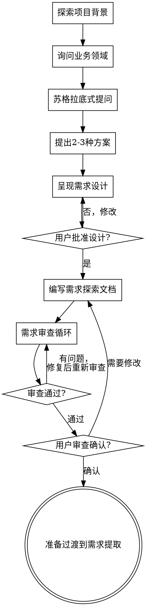

# 需求探索与头脑风暴

通过自然的协作对话，将模糊的想法转化为完整的需求设计。

首先理解当前项目背景，然后通过苏格拉底式提问逐一深入探索。理解清楚后，呈现需求设计并获得用户批准。

<HARD-GATE>
在呈现需求设计并获得用户批准之前，**不得**调用任何实现技能、编写任何代码、搭建任何项目或采取任何实现行动。这适用于**所有项目**，无论看起来多么简单。
</HARD-GATE>

## 反模式："这个太简单了不需要设计"

每个项目都要经过这个流程。一个待办清单、一个单函数工具、一个配置更改——所有这些都是。"简单"的项目正是那些未经审视的假设导致最多返工的地方。设计可以很短（对于真正简单的项目只需几句话），但你**必须**呈现并获得批准。

---

## 检查清单

必须为以下每项创建任务并按顺序完成：

1. **探索项目背景** — 检查文件、文档、最近提交
2. **询问业务领域** — 了解行业背景、业务目标
3. **苏格拉底式提问** — 一次一个问题，深入挖掘需求
4. **提出 2-3 种方案** — 带权衡分析和推荐建议
5. **呈现需求设计** — 按复杂度分节呈现，每节后获得确认
6. **编写需求探索文档** — 保存到项目目录并提交
7. **需求审查循环** — 调用 yg-requirement-reviewer 进行审查
8. **用户审查确认** — 请用户审查文档后再继续
9. **过渡到需求提取** — 准备调用 yg-requirement-extraction 技能

---

## 流程图



**终止状态是准备过渡到需求提取。** 不要调用 frontend-design、mcp-builder 或任何其他实现技能。头脑风暴之后唯一要做的是过渡到 yg-requirement-extraction。

---

## 详细流程

### 1. 探索项目背景

在开始提问之前，先了解当前项目状态：

- 检查 `.yg-pm/projects/` 目录了解现有项目
- 读取相关项目文档和元数据
- 了解最近的开发活动和讨论

**作用域评估**：如果请求描述了多个独立子系统（例如"构建一个包含聊天、文件存储、计费和分析的平台"），立即标记。不要在需要分解的项目上花费问题细化细节。

如果项目太大无法用单个需求文档覆盖，帮助用户分解为子项目：有哪些独立部分？它们如何关联？应该按什么顺序构建？然后通过正常流程探索第一个子项目。每个子项目都有自己的需求探索 → 提取 → 文档编写循环。

### 2. 询问业务领域

了解业务背景是理解需求的基础：

| 探索方向 | 示例问题 |
|---------|---------|
| 行业背景 | "这个行业的主要挑战是什么？" |
| 业务目标 | "您希望通过这个项目实现什么目标？" |
| 目标用户 | "这个系统的使用者是谁？" |
| 当前状态 | "目前是怎么做的？有什么痛点？" |
| 期望状态 | "理想的状态是什么样的？" |

### 3. 苏格拉底式提问

采用苏格拉底式提问法，通过以下三类问题引导思考：

#### 澄清性问题 — 明确概念和范围

- "您说的XXX具体指什么？"
- "能举个例子吗？"
- "这个范围包括哪些？不包括哪些？"

#### 探索性问题 — 挖掘深层需求

- "为什么会需要这个功能？"
- "目前是怎么做的？有什么痛点？"
- "理想的状态是什么样的？"

#### 验证性问题 — 确认理解准确

- "我理解对吗，您的意思是...？"
- "这个需求的优先级如何？"
- "有什么约束或限制条件？"

**提问原则**：
- 一次只问一个问题 — 不要用多个问题压倒用户
- 优先使用选择题 — 比开放性问题更容易回答
- 关注理解：目的、约束、成功标准

### 4. 提出 2-3 种方案

在充分理解需求后：

- 提出 2-3 种不同的实现方案及其权衡
- 以对话方式呈现选项，给出推荐和理由
- 首先展示推荐的选项并解释原因

**方案对比格式**：

| 方案 | 优点 | 缺点 | 适用场景 |
|-----|------|------|---------|
| 方案A | ... | ... | ... |
| 方案B | ... | ... | ... |
| 方案C | ... | ... | ... |

### 5. 呈现需求设计

当您认为已经理解要构建什么时，呈现需求设计：

- 按复杂度调整每节篇幅：如果简单则几句话，如果复杂则 200-300 字
- 每节之后询问是否正确
- 涵盖：架构、组件、数据流、错误处理、测试

**设计隔离与清晰性**：

- 将系统分解为更小的单元，每个单元有一个明确目的，通过定义良好的接口通信，可以独立理解和测试
- 对于每个单元，您应该能够回答：它做什么？如何使用它？它依赖什么？
- 有人能否在不阅读内部实现的情况下理解单元的功能？能否在不破坏使用者的情况下更改内部实现？如果不能，边界需要改进

**在现有代码库中工作**：

- 在提出更改之前探索当前结构。遵循现有模式。
- 在工作受到影响的地方（例如，变得太大的文件、边界不清、职责纠缠），将针对性改进作为设计的一部分
- 不要提出无关的重构。专注于服务于当前目标的内容。

### 6. 编写需求探索文档

将验证通过的需求设计写入项目目录：

**文档保存位置**：
```
.yg-pm/projects/{项目名}/drafts/需求探索_{日期}.md
```

**文档结构**：

```markdown
# 需求探索文档

**项目名称**：{项目名}
**探索日期**：{日期}
**文档状态**：待确认/已确认

---

## 一、业务背景

[业务环境、市场情况、公司战略等]

## 二、用户画像

[目标用户群体、角色、特征]

## 三、核心需求

### 3.1 功能需求

| 编号 | 功能名称 | 优先级 | 说明 |
|-----|---------|-------|------|
| F01 | ... | P0/P1/P2 | ... |

### 3.2 非功能需求

[性能要求、安全要求、兼容性要求]

## 四、业务流程

[核心业务流程描述，可包含流程图]

## 五、数据模型概要

[主要数据实体和关系]

## 六、约束条件

[预算、时间、资源、政策法规限制]

## 七、待确认事项

- [ ] 待确认1
- [ ] 待确认2

## 八、下一步建议

完成需求探索后，建议使用：
- `/yg-requirement-extraction` - 将探索结果提取为规范需求文档
```

### 7. 需求审查循环

编写需求探索文档后，调用 **requirement-exploration-reviewer** Agent 进行审查：

```
Agent 工具调用：
  subagent_type: general-purpose
  name: requirement-exploration-reviewer
  prompt: 审查文档：.yg-pm/projects/{项目名}/drafts/需求探索_{日期}.md
```

**审查流程**：
1. 调用 Agent 进行审查
2. 如果发现问题：修复，重新审查，重复直到通过
3. 如果循环超过 3 次，提交给人工指导

### 8. 用户审查确认

需求审查循环通过后，请用户审查书面文档：

> "需求探索文档已编写完成并保存到 `<路径>`。请审查文档，如果有需要修改的地方请告诉我。确认无误后我们将继续进行需求提取。"

等待用户响应。如果他们要求更改，进行更改并重新运行需求审查循环。只有在用户确认后才继续。

### 9. 过渡到需求提取

用户确认后，准备过渡到需求提取：

**输出过渡提示**：

```
✓ 需求探索完成

文档路径：.yg-pm/projects/{项目名}/drafts/需求探索_{日期}.md

下一步：使用 /yg-requirement-extraction 将探索结果提取为规范的需求文档
```

---

## 核心原则

- **一次一个问题** — 不要用多个问题压倒用户
- **优先选择题** — 比开放性问题更容易回答
- **坚决执行 YAGNI** — 从所有设计中删除不必要的功能
- **探索替代方案** — 在确定之前总是提出 2-3 种方案
- **增量验证** — 呈现设计，获得批准后再继续
- **灵活应变** — 当某些内容不合理时返回澄清

---

## 输出内容

探索完成后，输出以下内容：

| 项目 | 说明 |
|------|------|
| 业务背景 | 业务环境、市场情况、公司战略等 |
| 用户画像 | 目标用户群体、角色、特征 |
| 功能点列表 | 初步的功能需求清单 |
| 待确认问题 | 需要进一步确认的事项 |

---

## 下一步建议

完成需求探索后，建议使用：
- `/yg-requirement-extraction` - 将探索结果提取为规范需求文档