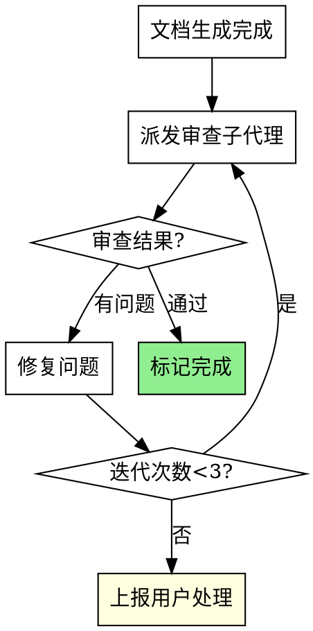

# 文档编写

## 触发条件

TRIGGER when: 用户提及以下关键词：
- "生成需求文档"
- "编写需求文档"
- "撰写需求文档"
- "输出需求文档"
- "需求文档编写"

## 适用场景

- 编写商业需求文档（BRD）
- 编写产品需求文档（PRD）
- 编写技术需求文档（TRD）
- 编写软件需求规格说明书（SRS）
- 编写设计需求文档（DRD）

## 支持文档类型

| 类型 | 全称 | 适用场景 |
|-----|------|---------|
| BRD | Business Requirements Document | 商业层面需求，项目立项 |
| PRD | Product Requirements Document | 产品功能需求，详细设计 |
| TRD | Technical Requirements Document | 技术实现需求 |
| SRS | Software Requirements Specification | 软件需求规格说明 |
| DRD | Design Requirements Document | 设计需求文档 |

## 超出范围处理

当用户请求的文档类型不在上述支持列表中时：

1. **告知用户**：说明当前技能不支持的文档类型
2. **引导创建**：建议用户调用 `/yg-create-document-template` 技能创建新的文档模板
3. **示例话术**：
   > "当前技能暂不支持「XXX」类型的文档。您可以使用 `/yg-create-document-template` 技能创建新的文档模板，或选择以下已支持的类型：BRD、PRD、TRD、SRS、DRD。"

## 场景模板

| 模板 | 说明 |
|-----|------|
| Automation | 自动化流程类需求 |
| Permission | 权限管理类需求 |
| Dashboard | 数据仪表盘类需求 |

## 使用方式

```bash
# 交互式选择文档类型
/yg-document-writing

# 直接指定文档类型
/yg-document-writing prd
/yg-document-writing brd
```

## 执行流程

1. **类型确认** - 确定文档类型（如已指定参数则跳过）
2. **模板加载** - 加载对应文档模板
3. **信息收集** - 收集文档所需信息
4. **文档生成** - 按模板生成文档
5. **质量检查** - 检查文档完整性
6. **审查闭环** - 派发审查子代理，自动修复问题（见"文档审查闭环"章节）

---

## 文档审查闭环

文档生成后，自动触发审查闭环以确保文档质量。

### 审查流程



### 审查子代理派发

使用 Agent 工具派发审查子代理，提供精准的审查上下文：

```
Agent tool (general-purpose):
  description: "Review document quality"
  prompt: |
    参考 ./document-reviewer-prompt.md 中的模板
    提供文档路径、文档类型、模板路径
```

### 问题修复

当审查发现问题时：
1. **同一代理修复**：保持上下文连贯
2. **最小修复原则**：只修复报告的具体问题，不过度修改
3. **重新审查**：修复后必须重新派发审查子代理

### 迭代限制

- 最多 3 次迭代
- 超过限制后上报用户，由用户决定后续处理

### 审查标准

| 类别 | 检查内容 |
|------|---------|
| 模板合规性 | 必要章节是否存在，结构是否符合模板 |
| 完整性 | 无 TODO、占位符、"待补充"标记 |
| 内容质量 | 描述具体不模糊，业务逻辑清晰 |
| 内部一致性 | 术语一致，无矛盾描述 |
| 可追溯性 | 功能编号引用正确，交叉引用有效 |

---

## 交互式提问规范

**涉及用户交互时必须使用 AskUserQuestion 工具**，遵循以下原则：

| 原则 | 说明 |
|-----|------|
| **一次一问** | 每次只提出一个问题，等待用户回答后再继续 |
| **提供选项** | 为每个问题提供 2-4 个预设选项 |
| **保留自定义** | 依靠"其他"选项让用户自由表达 |
| **单选为主** | 大多数情况使用单选（multiSelect: false） |

### 文档类型确认示例

```json
{
  "questions": [{
    "question": "您需要编写哪种类型的需求文档？",
    "header": "文档类型",
    "multiSelect": false,
    "options": [
      { "label": "PRD（推荐）", "description": "产品需求文档，详细描述产品功能与用户体验" },
      { "label": "BRD", "description": "商业需求文档，阐述商业价值与业务目标" },
      { "label": "TRD", "description": "技术需求文档，描述技术实现方案" },
      { "label": "SRS", "description": "软件需求规格说明书，完整的功能与非功能需求" }
    ]
  }]
}
```

### 场景模板选择示例

```json
{
  "questions": [{
    "question": "检测到您的需求涉及自动化流程，是否使用场景模板？",
    "header": "场景模板",
    "multiSelect": false,
    "options": [
      { "label": "使用自动化模板", "description": "自动填充流程触发条件、执行动作等章节" },
      { "label": "使用通用模板", "description": "使用标准 PRD 模板，不预填内容" },
      { "label": "跳过模板", "description": "完全自定义文档结构" }
    ]
  }]
}
```

---

## 渐进式披露结构

```
yg-document-writing/
├── SKILL.md              # 主文件，负责类型选择
└── references/           # 模板参考文件
    ├── brd-template.md   # BRD模板
    ├── prd-template.md   # PRD模板
    ├── trd-template.md   # TRD模板
    ├── srs-template.md   # SRS模板
    ├── drd-generator.md  # DRD生成器
    ├── automation-template.md     # 自动化场景模板
    ├── permission-matrix-template.md  # 权限矩阵模板
    ├── view-dashboard-template.md    # 视图仪表盘模板
    └── forguncy-project.md    # 活字格项目特征说明
```

## 参考文件

所有模板文件位于技能目录下的 `references/` 文件夹：

| 文件 | 说明 |
|------|------|
| `references/brd-template.md` | BRD 商业需求文档模板 |
| `references/prd-template.md` | PRD 产品需求文档模板 |
| `references/trd-template.md` | TRD 技术需求文档模板 |
| `references/srs-template.md` | SRS 软件需求规格说明模板 |
| `references/drd-generator.md` | DRD 设计需求文档生成器 |
| `references/er-diagram-guide.md` | ER图设计规范指南 |
| `references/diagram-types-guide.md` | 需求文档图表类型指南 |
| `references/automation-template.md` | 自动化场景设计模板 |
| `references/permission-matrix-template.md` | 权限矩阵设计模板 |
| `references/view-dashboard-template.md` | 视图与仪表盘设计模板 |
| `references/forguncy-project.md` | 活字格类型项目必须先阅读此文档 |

## 下一步建议

文档编写完成后，系统已自动完成质量审查。后续可选：
- `/yg-requirement-reviewer` - 进行深度需求审查与仿真验证
- `/yg-visualize` - 可视化文档生成原型