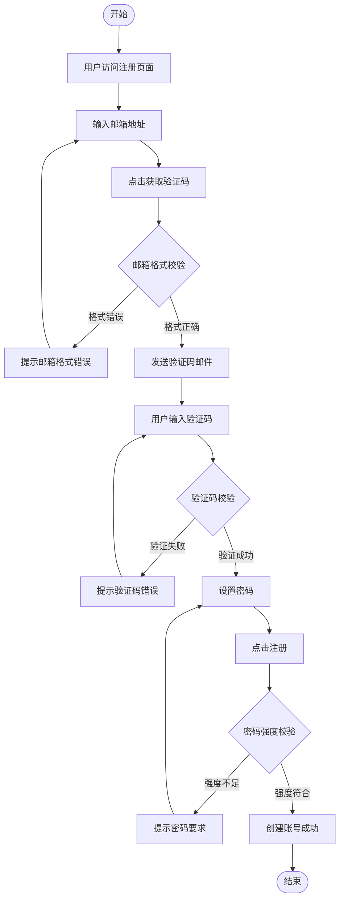
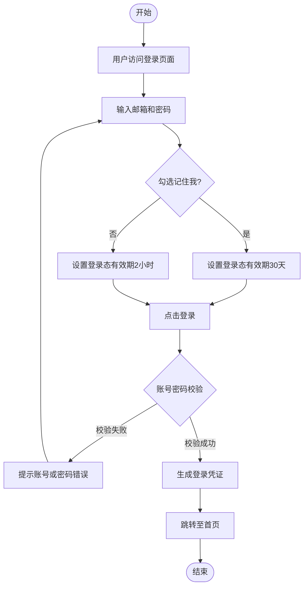
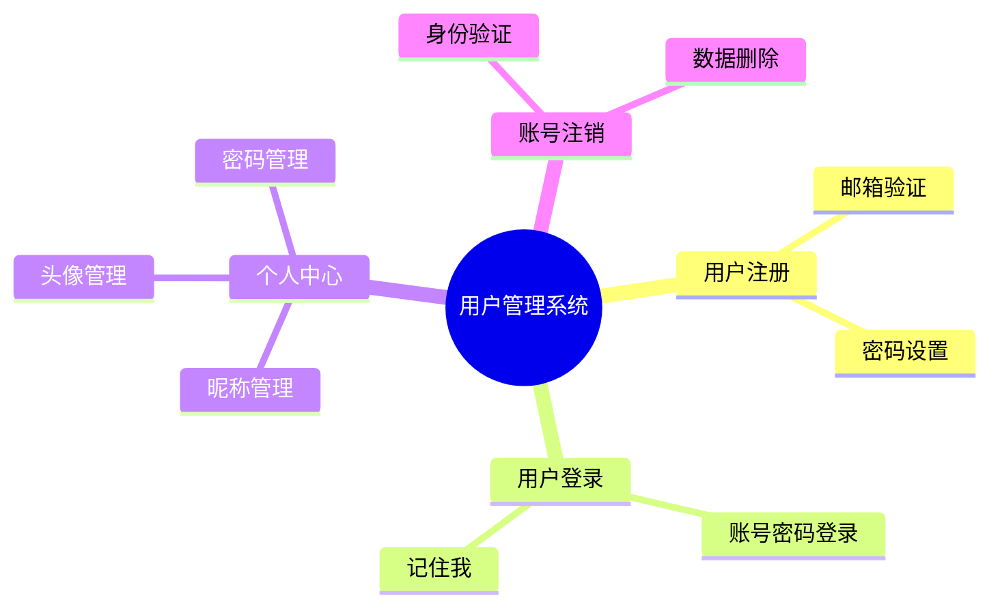
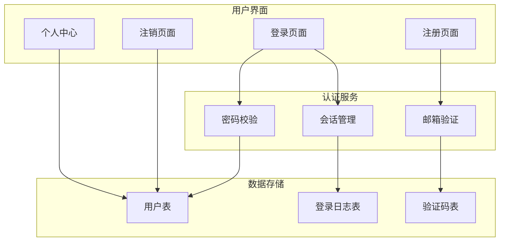
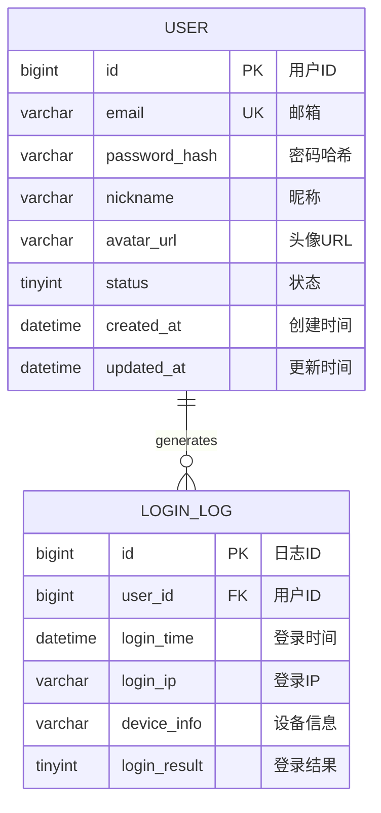

# 产品需求文档（PRD）

## 文档信息

**产品名称：** 用户管理系统
**文档版本：** v1.0
**创建日期：** 2026-03-27
**产品经理：** [待填写]
**状态：** 草稿

---

## 1. 产品概述

### 1.1 产品背景

企业内部存在多个业务系统，员工需要分别登录各个系统，账号管理分散、用户体验差、安全风险高。为解决这一问题，需要建设统一的用户管理系统，实现单点登录和统一权限管理。

### 1.2 产品定位

用户管理系统是企业内部基础设施类产品，定位为统一的身份认证与权限管理中心，为各类业务系统提供统一的登录入口和权限控制能力。

### 1.3 目标用户

**主要用户：** 企业内部员工

**用户画像：**
- 年龄：25-45岁
- 特征：需要使用公司各类业务系统的员工
- 需求：希望一个账号通行所有系统，简化登录流程

### 1.4 产品目标

- **业务目标：** 实现企业内部系统的统一身份认证，降低账号管理成本
- **用户目标：** 员工可使用单一账号登录所有业务系统
- **技术目标：** 构建安全、稳定、高性能的身份认证服务

---

## 2. 用户场景

### 2.1 用户旅程地图

**场景1：新员工入职注册**
- **用户：** 新入职员工
- **目标：** 完成账号注册，获取系统访问权限
- **步骤：**
  1. 收到系统发送的注册邀请邮件
  2. 点击邮件中的注册链接
  3. 填写邮箱并获取验证码
  4. 设置密码完成注册
- **痛点：** 注册流程繁琐、验证码可能被拦截
- **解决方案：** 简化注册流程，支持企业邮箱快速验证

**场景2：日常登录使用**
- **用户：** 已注册员工
- **目标：** 快速登录系统
- **步骤：**
  1. 打开登录页面
  2. 输入邮箱和密码
  3. 勾选"记住我"（可选）
  4. 点击登录进入系统
- **痛点：** 频繁输入账号密码
- **解决方案：** 支持"记住我"功能，延长登录态有效期

### 2.2 用户故事

1. 作为一名新员工，我想要通过邮箱注册账号，以便于访问公司各类系统
2. 作为一名员工，我想要使用邮箱和密码登录系统，以便于快速进入工作状态
3. 作为一名员工，我想要修改个人信息，以便于保持资料最新
4. 作为一名员工，我想要注销账号，以便于离职时清除个人信息

---

## 3. 功能需求

### 3.1 核心功能（P0 - MVP必需）

#### 3.1.1 用户注册

**功能描述：**
支持员工通过企业邮箱注册账号，注册时需进行邮箱验证码验证，确保邮箱真实有效。

**用户价值：**
为新员工提供便捷的自助注册入口，降低IT管理员的账号创建工作量。

**功能流程：**

**详细规则：**
- 规则1：仅支持企业邮箱注册（如 @company.com）
- 规则2：验证码有效期为5分钟
- 规则3：密码长度不少于8位，需包含字母和数字
- 规则4：同一邮箱60秒内只能发送一次验证码

**界面要求：**
- **页面布局：** 居中卡片式布局，包含邮箱输入框、验证码输入框、密码输入框、确认密码输入框
- **交互方式：** 验证码按钮倒计时显示，表单实时校验
- **视觉设计：** 简洁企业风格，主色调为蓝色

**数据要求：**
- **输入：** 邮箱地址、验证码、密码
- **输出：** 注册成功/失败提示
- **存储：** 用户ID、邮箱（加密）、密码（哈希）、创建时间

**异常处理：**
- 邮箱已注册 → 提示"该邮箱已注册，请直接登录"
- 验证码过期 → 提示"验证码已过期，请重新获取"
- 邮箱发送失败 → 提示"验证码发送失败，请稍后重试"

**验收标准：**
- [ ] 用户可通过企业邮箱完成注册
- [ ] 验证码可正常发送和验证
- [ ] 密码强度校验正常工作
- [ ] 注册成功后可正常登录

#### 3.1.2 用户登录

**功能描述：**
支持员工使用邮箱和密码登录系统，支持"记住我"功能延长登录态有效期。

**用户价值：**
为员工提供安全便捷的登录体验，减少重复登录操作。

**功能流程：**

**详细规则：**
- 规则1：连续5次密码错误，账号锁定30分钟
- 规则2："记住我"状态下登录态有效期为30天
- 规则3：非"记住我"状态下登录态有效期为2小时
- 规则4：登录成功后记录登录日志

**界面要求：**
- **页面布局：** 居中卡片式布局，包含邮箱输入框、密码输入框、记住我复选框、登录按钮
- **交互方式：** 支持回车键登录，密码输入框支持显示/隐藏切换
- **视觉设计：** 与注册页面风格一致

**数据要求：**
- **输入：** 邮箱、密码、记住我标识
- **输出：** 登录凭证（Token）
- **存储：** 登录日志（用户ID、登录时间、登录IP、设备信息）

**异常处理：**
- 账号不存在 → 提示"账号不存在，请先注册"
- 密码错误 → 提示"账号或密码错误"
- 账号锁定 → 提示"账号已锁定，请30分钟后重试"

**验收标准：**
- [ ] 用户可使用邮箱和密码正常登录
- [ ] "记住我"功能正常工作
- [ ] 登录失败有明确的错误提示
- [ ] 登录日志正常记录

#### 3.1.3 个人信息管理

**功能描述：**
支持用户修改昵称、头像、密码等个人信息。

**用户价值：**
让用户能够自主维护个人资料，提升账号安全性和个性化体验。

**详细规则：**
- 规则1：昵称长度限制为2-20个字符
- 规则2：头像支持JPG、PNG格式，大小不超过2MB
- 规则3：修改密码需验证原密码
- 规则4：新密码不能与原密码相同

**界面要求：**
- **页面布局：** 左侧个人信息卡片，右侧表单区域
- **交互方式：** 头像点击可上传，表单实时校验
- **视觉设计：** 卡片式布局，信息层次清晰

**数据要求：**
- **输入：** 昵称、头像文件、原密码、新密码
- **输出：** 更新成功/失败提示
- **存储：** 更新后的用户信息

**验收标准：**
- [ ] 用户可修改昵称
- [ ] 用户可上传头像
- [ ] 用户可修改密码
- [ ] 信息修改实时生效

#### 3.1.4 账号注销

**功能描述：**
支持用户申请注销账号，注销后账号数据将被永久删除。

**用户价值：**
尊重用户的数据所有权，提供账号退出的合规途径。

**详细规则：**
- 规则1：注销前需验证用户身份（密码或验证码）
- 规则2：注销后账号数据保留7天后永久删除
- 规则3：注销后邮箱可在30天后重新注册
- 规则4：注销操作不可撤销

**界面要求：**
- **页面布局：** 确认弹窗，包含注销须知和确认按钮
- **交互方式：** 二次确认机制
- **视觉设计：** 警告色提示，强调操作不可逆

**验收标准：**
- [ ] 用户可发起注销申请
- [ ] 注销前有身份验证
- [ ] 注销后有明确提示
- [ ] 注销后账号无法登录

---

## 4. 产品架构

### 4.1 信息架构

### 4.2 功能架构

---

## 5. 数据需求

### 5.1 数据模型

#### 实体1：用户（User）

| 字段名 | 类型 | 必填 | 默认值 | 说明 |
|--------|------|------|--------|------|
| id | BIGINT | 是 | 自增 | 用户ID，主键 |
| email | VARCHAR(100) | 是 | - | 邮箱地址，唯一索引 |
| password_hash | VARCHAR(255) | 是 | - | 密码哈希值 |
| nickname | VARCHAR(50) | 否 | NULL | 昵称 |
| avatar_url | VARCHAR(500) | 否 | NULL | 头像URL |
| status | TINYINT | 是 | 1 | 状态：1-正常，0-禁用，2-待注销 |
| created_at | DATETIME | 是 | CURRENT_TIMESTAMP | 创建时间 |
| updated_at | DATETIME | 是 | CURRENT_TIMESTAMP | 更新时间 |

**数据验证：**
- 邮箱格式校验
- 密码长度不小于8位
- 昵称长度2-20个字符

#### 实体2：登录日志（LoginLog）

| 字段名 | 类型 | 必填 | 默认值 | 说明 |
|--------|------|------|--------|------|
| id | BIGINT | 是 | 自增 | 日志ID，主键 |
| user_id | BIGINT | 是 | - | 用户ID，外键 |
| login_time | DATETIME | 是 | CURRENT_TIMESTAMP | 登录时间 |
| login_ip | VARCHAR(50) | 否 | NULL | 登录IP |
| device_info | VARCHAR(255) | 否 | NULL | 设备信息 |
| login_result | TINYINT | 是 | - | 结果：1-成功，0-失败 |

### 5.2 数据ER图

---

## 6. 非功能需求

### 6.1 性能需求

- **页面加载：** ≤ 2秒
- **接口响应：** ≤ 500ms
- **并发支持：** ≥ 1000用户

### 6.2 安全需求

- **数据安全：** 密码使用bcrypt加密存储，敏感信息传输使用HTTPS
- **用户隐私：** 个人信息仅用于系统内展示，不对外泄露
- **访问控制：** 未登录用户只能访问注册和登录页面

### 6.3 可用性需求

- **易用性：** 界面简洁明了，新用户无需培训即可使用
- **可访问性：** 支持主流浏览器（Chrome、Firefox、Edge）
- **国际化：** 暂不支持，仅中文界面

---

## 7. 发布计划

### 7.1 版本规划

**V1.0（MVP版本）**
- **发布时间：** [待定]
- **核心功能：** 用户注册、用户登录、个人信息管理、账号注销
- **目标：** 完成基础用户管理功能，支持企业内部员工自助注册和使用

---

## 附录

### A. 需求映射表

| 章节 | 关联需求ID | 需求摘要 |
|------|------------|----------|
| 3.1.1 用户注册 | REQ-001 | 邮箱注册，验证码验证 |
| 3.1.2 用户登录 | REQ-002 | 邮箱+密码登录，记住我 |
| 3.1.3 个人信息管理 | REQ-003 | 修改昵称、头像、密码 |
| 3.1.4 账号注销 | REQ-004 | 申请注销账号 |
| 6.1 性能需求 | NFR-001, NFR-002 | 响应时间<500ms，1000并发 |

### B. 变更历史

| 版本 | 日期 | 变更内容 | 变更人 |
|-----|------|---------|--------|
| v1.0 | 2026-03-27 | 初始版本 | 测试验证Agent |

---

**最后更新：** 2026-03-27