# 需求文档图表类型指南

本文档定义需求文档中各类图表的使用规范，确保文档表达清晰、专业。

## 图表类型总览

| 图表类型 | Mermaid语法 | 适用场景 | 主要用途 |
|---------|------------|---------|---------|
| 流程图 | `flowchart` / `graph` | 业务流程、功能流程、操作步骤 | 展示流程走向和决策分支 |
| 架构图 | `flowchart` / 自定义 | 系统架构、功能架构、技术架构 | 展示系统组成和层次关系 |
| 时序图 | `sequenceDiagram` | 接口调用、系统交互、操作序列 | 展示对象间的时序交互 |
| 状态图 | `stateDiagram-v2` | 状态流转、生命周期 | 展示对象状态变化 |
| ER图 | `erDiagram` | 数据模型、数据库设计 | 展示实体关系 |
| 甘特图 | `gantt` | 项目计划、时间线 | 展示任务时间安排 |
| 思维导图 | `mindmap` | 信息架构、需求分解 | 展示层次结构 |
| 网络拓扑 | `flowchart` | 部署架构、网络结构 | 展示网络节点连接 |

---

## 1. 流程图（Flowchart）

### 适用章节

| 文档类型 | 章节 | 必须性 |
|---------|------|--------|
| PRD | 3.1 功能流程 | 推荐 |
| PRD | 5.1 交互流程 | 必须 |
| TRD | 9.2 部署流程 | 推荐 |
| SRS | 3.2 业务流程 | 必须 |
| SRS | 4.2 功能流程 | 必须 |

### Mermaid语法

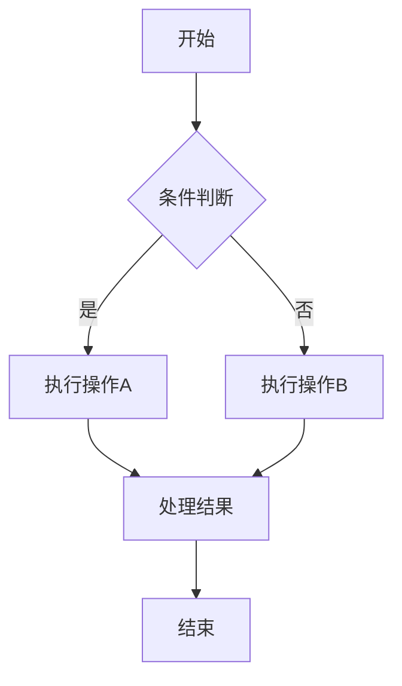

### 节点类型

| 语法 | 形状 | 用途 |
|------|------|------|
| `A[文本]` | 矩形 | 普通步骤 |
| `A{文本}` | 菱形 | 判断/决策 |
| `A([文本])` | 圆角矩形 | 开始/结束 |
| `A((文本))` | 圆形 | 连接点 |
| `A[[文本]]` | 子程序 | 子流程 |
| `A[(文本)]` | 圆柱 | 数据库 |
| `A>文本]` | 旗帜 | 事件 |

### 流程线类型

| 语法 | 含义 |
|------|------|
| `-->` | 实线箭头 |
| `---` | 实线无箭头 |
| `-.->` | 虚线箭头 |
| `==>` | 粗线箭头 |
| `--文本-->` | 带标签的线 |

### 最佳实践

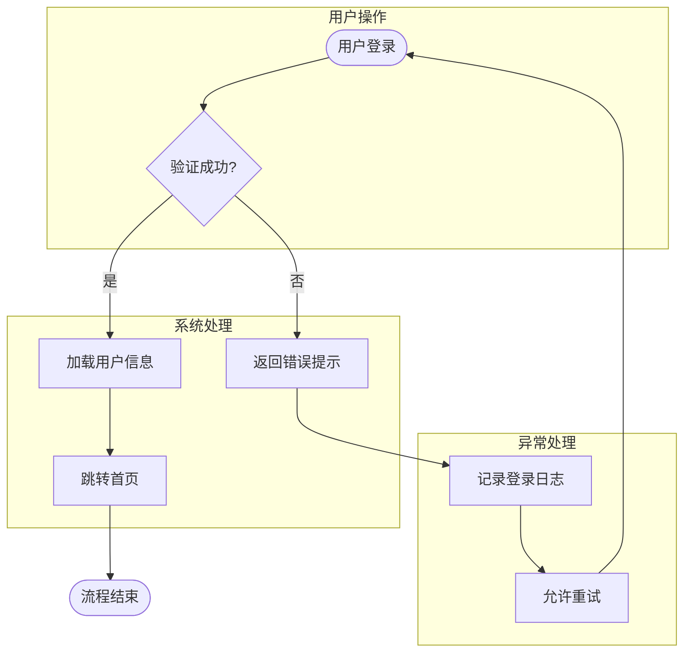

---

## 2. 架构图（Architecture Diagram）

### 适用章节

| 文档类型 | 章节 | 必须性 |
|---------|------|--------|
| PRD | 4.2 功能架构 | 必须 |
| TRD | 2.1 整体架构 | 必须 |
| TRD | 2.3 服务划分 | 推荐 |

### Mermaid语法示例

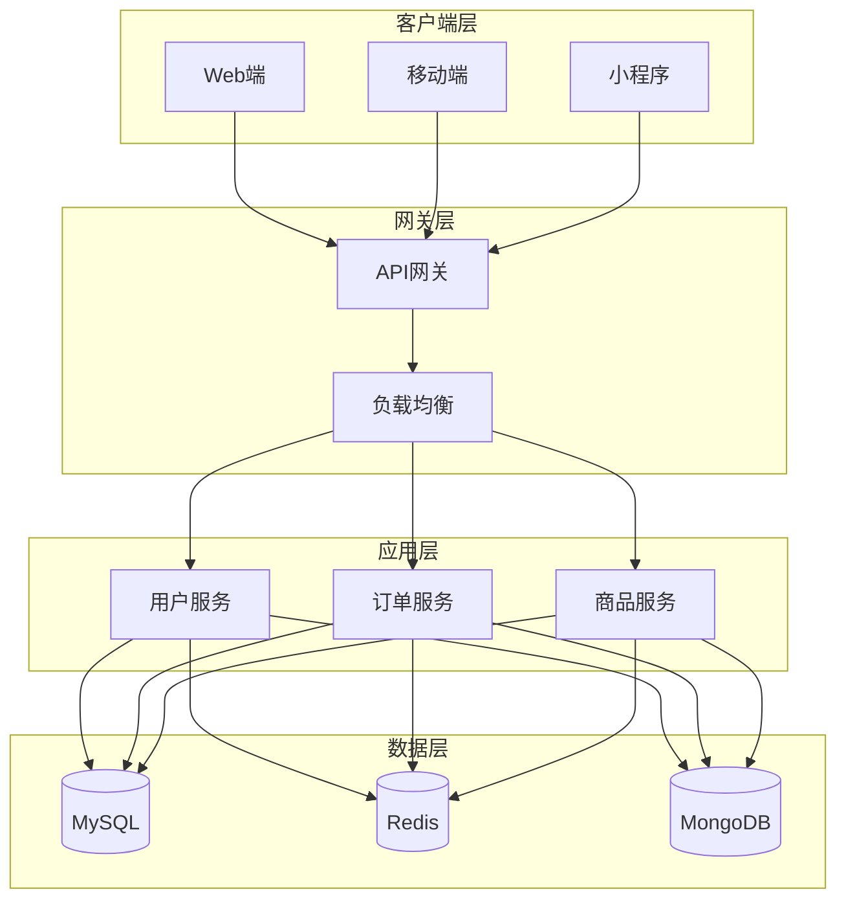

### 架构图层次

```
┌─────────────────────────────────────────────┐
│                  展示层                      │
├─────────────────────────────────────────────┤
│                  网关层                      │
├─────────────────────────────────────────────┤
│                  服务层                      │
├─────────────────────────────────────────────┤
│                  数据层                      │
└─────────────────────────────────────────────┘
```

### 功能架构示例

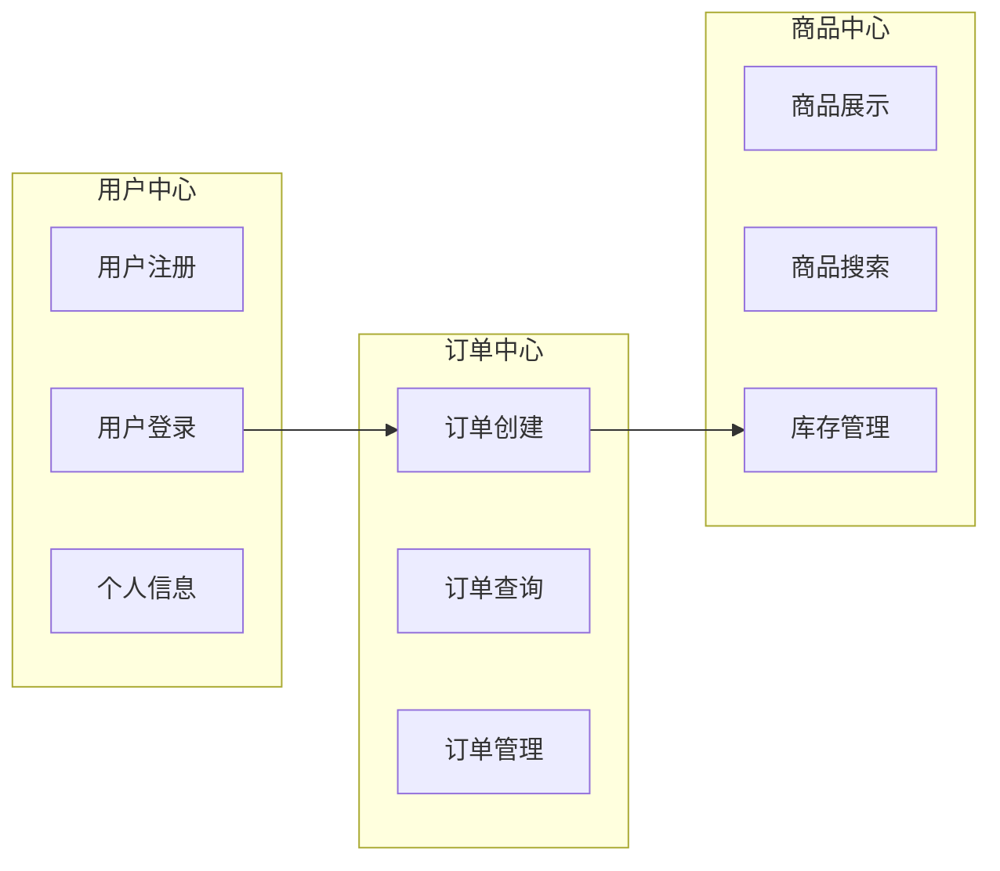

---

## 3. 时序图（Sequence Diagram）

### 适用章节

| 文档类型 | 章节 | 必须性 |
|---------|------|--------|
| PRD | 5.1 交互流程 | 推荐 |
| TRD | 3.2 核心接口 | 推荐 |
| SRS | 8.2 内部接口 | 推荐 |

### Mermaid语法

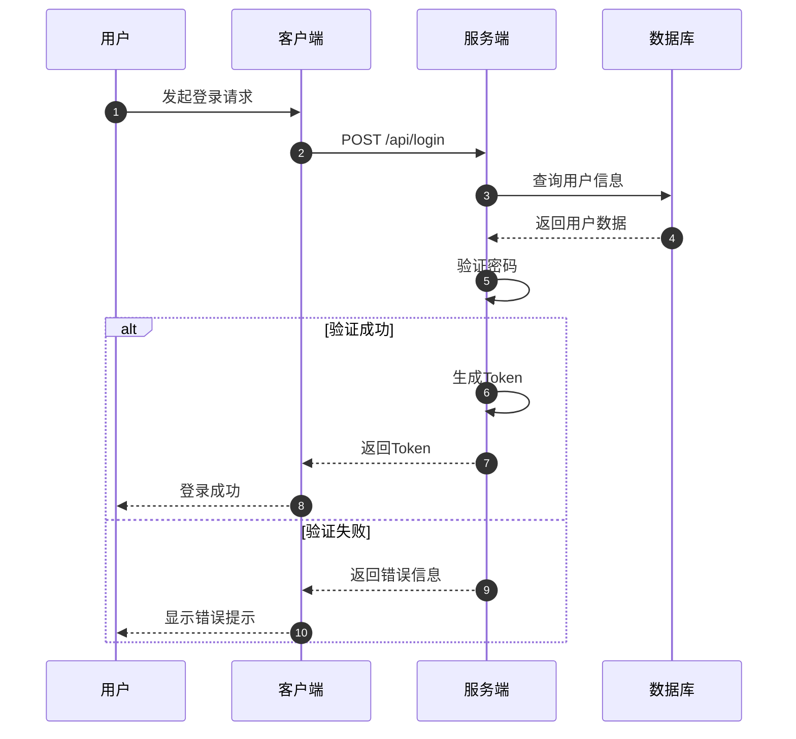

### 语法说明

| 语法 | 含义 |
|------|------|
| `->>` | 实线箭头（请求） |
| `-->>` | 虚线箭头（响应） |
| `--)` | 异步消息 |
| `--x` | 失败返回 |
| `loop` | 循环 |
| `alt/else` | 条件分支 |
| `opt` | 可选操作 |
| `par` | 并行操作 |

### 复杂时序图示例

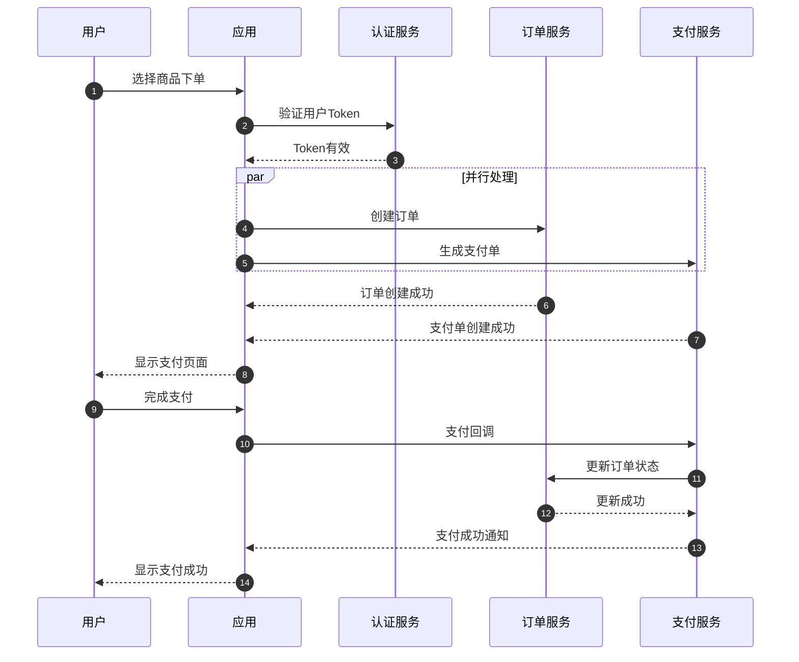

---

## 4. 状态图（State Diagram）

### 适用章节

| 文档类型 | 章节 | 必须性 |
|---------|------|--------|
| PRD | 5.2 状态转换 | 必须 |
| TRD | 业务对象状态 | 推荐 |
| SRS | 功能状态流转 | 推荐 |

### Mermaid语法

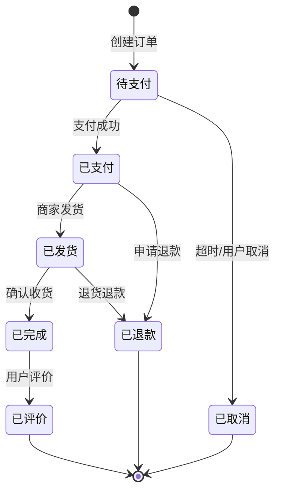

### 状态图语法

| 语法 | 含义 |
|------|------|
| `[*]` | 初始/终止状态 |
| `-->` | 状态转换 |
| `: 文本` | 转换条件 |

### 复合状态示例

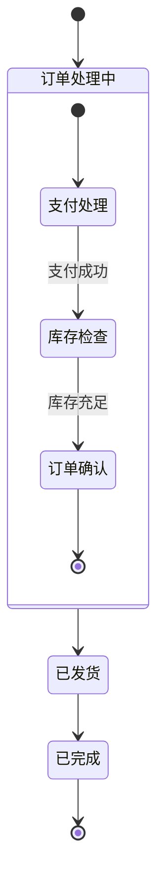

---

## 5. ER图（Entity-Relationship Diagram）

### 适用章节

| 文档类型 | 章节 | 必须性 |
|---------|------|--------|
| PRD | 6.2 数据ER图 | 必须 |
| TRD | 4.4 数据ER图 | 必须 |
| SRS | 5.4 数据ER图 | 必须 |

详细规范请参考 [er-diagram-guide.md](./er-diagram-guide.md)。

### 快速示例

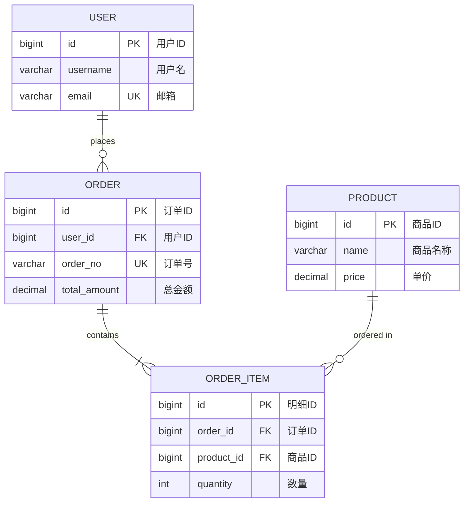

---

## 6. 甘特图（Gantt Chart）

### 适用章节

| 文档类型 | 章节 | 必须性 |
|---------|------|--------|
| PRD | 10.1 版本规划 | 推荐 |
| SRS | 11.1 时间约束 | 推荐 |
| SRS | 13.1 实施计划 | 必须 |

### Mermaid语法

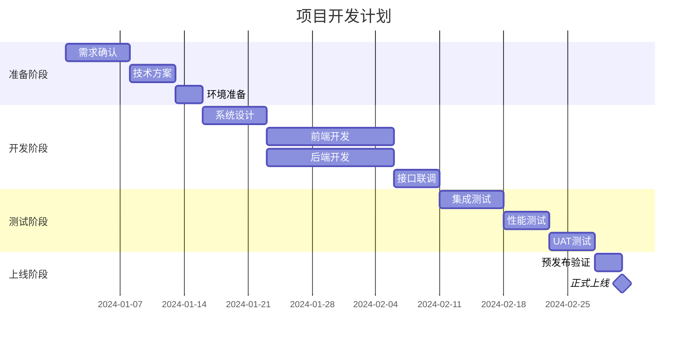

### 甘特图语法

| 语法 | 含义 |
|------|------|
| `title` | 图表标题 |
| `dateFormat` | 日期格式 |
| `section` | 分组 |
| `任务名 :id, 开始日期, 持续时间` | 任务定义 |
| `after id` | 依赖关系 |
| `:milestone` | 里程碑 |

---

## 7. 思维导图（Mindmap）

### 适用章节

| 文档类型 | 章节 | 必须性 |
|---------|------|--------|
| PRD | 4.1 信息架构 | 必须 |
| SRS | 2.1 项目范围 | 推荐 |

### Mermaid语法

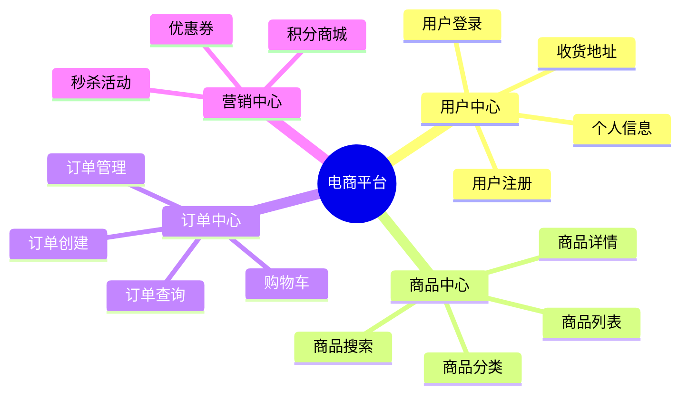

### 思维导图语法

| 语法 | 含义 |
|------|------|
| `root((标题))` | 根节点 |
| 缩进 | 层级关系 |
| `---` | 分隔符（可选） |

---

## 8. 网络拓扑图（Network Topology）

### 适用章节

| 文档类型 | 章节 | 必须性 |
|---------|------|--------|
| TRD | 2.1 整体架构 | 推荐 |
| TRD | 9.1 环境规划 | 必须 |
| SRS | 9. 系统环境 | 推荐 |

### Mermaid语法示例

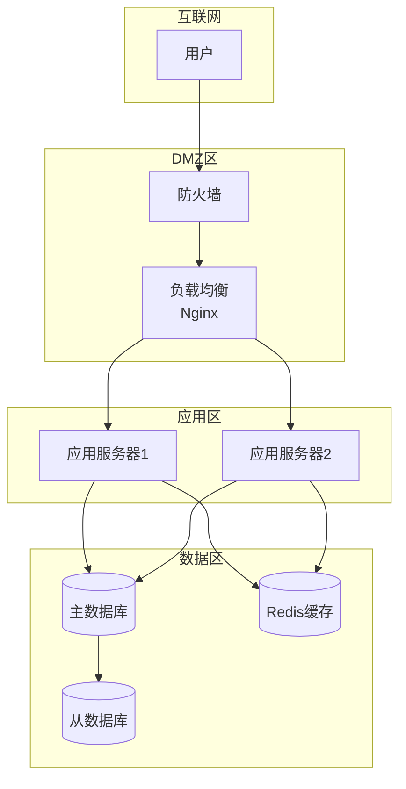

### 部署架构示例

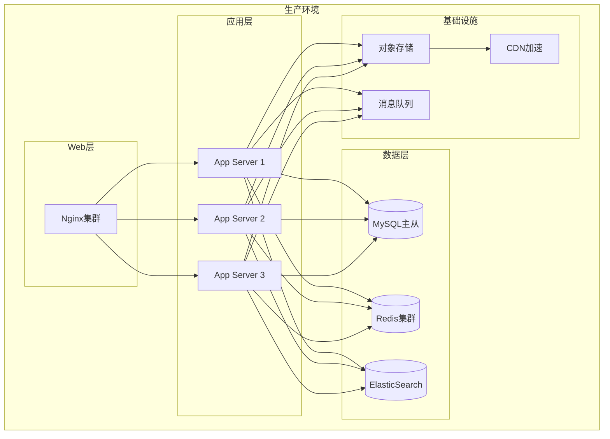

---

## 图表选择决策树

```
需要表达什么？
│
├─ 流程/步骤 → 流程图
│   ├─ 有判断分支 → flowchart TD
│   └─ 顺序执行 → flowchart LR
│
├─ 系统结构 → 架构图
│   ├─ 功能模块 → flowchart TB
│   └─ 技术组件 → flowchart TB + subgraph
│
├─ 对象交互 → 时序图
│   └─ sequenceDiagram
│
├─ 状态变化 → 状态图
│   └─ stateDiagram-v2
│
├─ 数据关系 → ER图
│   └─ erDiagram
│
├─ 时间计划 → 甘特图
│   └─ gantt
│
├─ 层次结构 → 思维导图
│   └─ mindmap
│
└─ 网络部署 → 网络拓扑
    └─ flowchart TB + subgraph
```

---

## 检查清单

### 文档图表完整性检查

**PRD文档：**
- [ ] 4.1 信息架构 → 思维导图
- [ ] 4.2 功能架构 → 架构图
- [ ] 5.1 交互流程 → 流程图/时序图
- [ ] 5.2 状态转换 → 状态图
- [ ] 6.2 数据ER图 → ER图

**TRD文档：**
- [ ] 2.1 整体架构 → 架构图
- [ ] 3.2 核心接口 → 时序图（可选）
- [ ] 4.4 数据ER图 → ER图
- [ ] 9.1 环境规划 → 网络拓扑图

**SRS文档：**
- [ ] 3.2 业务流程 → 流程图
- [ ] 4.2 功能流程 → 流程图
- [ ] 5.4 数据ER图 → ER图
- [ ] 13.1 实施计划 → 甘特图