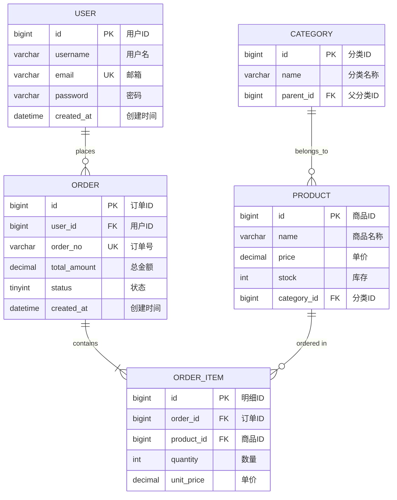

# ER图设计规范

## 什么是ER图

实体关系图（Entity-Relationship Diagram，简称ER图）是描述数据实体及其相互关系的可视化图形。它是数据库设计的重要工具，能够清晰展示：

- 数据实体（Entity）
- 实体属性（Attribute）
- 实体关系（Relationship）

## ER图符号说明

### 常用符号

| 符号 | 含义 | 说明 |
|------|------|------|
| 矩形 | 实体 | 表示数据实体 |
| 椭圆 | 属性 | 表示实体的属性 |
| 菱形 | 关系 | 表示实体之间的关系 |
| 线段 | 连接 | 连接实体与属性、实体与关系 |
| 双椭圆 | 多值属性 | 一个实体可有多个值的属性 |
| 虚线椭圆 | 派生属性 | 可从其他属性计算得出 |

### 关系基数符号（Crow's Foot符号）

| 符号 | 含义 | 示例 |
|------|------|------|
| `|` | 一 | 必须、仅有一个 |
| `O` | 零 | 可选、可以没有 |
| `>` | 多 | 可以有多个 |
| `|<` | 一对多 | 一个对应多个 |
| `O<` | 零或多 | 可选、可以有多个 |
| `|>|` | 一对一 | 双方都必须有一个 |

### 关系类型

```
一对一（1:1）    一对多（1:N）    多对多（M:N）
┌───┐            ┌───┐            ┌───┐
│ A │───┬───│ B ││ A │───<───│ B ││ A │───<───┬───>───│ B │
└───┘            └───┘            └───┘            │                └───┘
                                 │                │
                                 │                ▼
                                 │            ┌───────┐
                                 │            │关联表 │
                                 │            └───────┘
```

## ER图绘制格式

### Markdown格式（推荐）

使用Mermaid语法，可在支持Mermaid的环境中直接渲染：



### 文本描述格式

当Mermaid不支持时，使用文本格式：

```
┌─────────────────────────────────────────────────────────────────┐
│                         用户管理系统 ER图                         │
└─────────────────────────────────────────────────────────────────┘

                           ┌──────────────┐
                           │   用户(USER)  │
                           └──────┬───────┘
                                  │ 1
                                  │
                                  │ 下单
                                  │
                                  ▼ N
                           ┌──────────────┐
                           │ 订单(ORDER)   │
                           └──────┬───────┘
                                  │ 1
                                  │
                                  │ 包含
                                  │
                                  ▼ N
    ┌──────────────┐        ┌──────────────┐
    │ 商品(PRODUCT)│◄───────│订单明细(ITEM) │
    └──────────────┘   N    └──────────────┘
           ▲                        ▲
           │ 1                      │
           │                        │
           │ 属于                   │
           │                        │
           │ N                      │
    ┌──────────────┐                │
    │分类(CATEGORY)│                │
    └──────────────┘                │
           ▲                        │
           │ N                      │
           │                        │
           │ 父子关系               │
           │                        │
           └────────────────────────┘
                     1

图例说明：
  1 = 一
  N = 多
  ▲/▼/◄/► = 关系方向
```

## ER图文档模板

### 在需求文档中的标准格式

```markdown
### X.X 数据ER图

#### 实体关系图

```mermaid
erDiagram
    [实体定义和关系]
```

#### 实体说明

| 实体名称 | 中文名称 | 说明 | 数据量级 |
|---------|---------|------|---------|
| [实体1] | [中文名] | [说明] | [量级] |

#### 关系说明

| 关系名称 | 源实体 | 目标实体 | 关系类型 | 说明 |
|---------|--------|---------|---------|------|
| [关系1] | [实体A] | [实体B] | 1:N | [说明] |

#### 索引设计

| 表名 | 索引名 | 索引类型 | 字段 | 说明 |
|------|--------|---------|------|------|
| [表名] | idx_xxx | 普通 | [字段] | [说明] |
```

## ER图最佳实践

### 绘制原则

1. **完整性**：包含所有核心业务实体
2. **准确性**：正确标注关系类型和基数
3. **清晰性**：布局合理，避免交叉线
4. **规范性**：遵循命名规范

### 命名规范

| 类型 | 规范 | 示例 |
|------|------|------|
| 实体名 | 大写下划线 | USER, ORDER_ITEM |
| 属性名 | 小写下划线 | user_id, created_at |
| 主键 | id 或 表名_id | id, user_id |
| 外键 | 关联表名_id | order_id, user_id |
| 索引 | idx_表名_字段 | idx_order_user_id |

### 常见关系模式

#### 主从关系（1:N）

```
订单 ──< 订单明细
用户 ──< 订单
分类 ──< 商品
```

#### 多对多关系（M:N）

```
学生 >──< 课程（通过选课表）
用户 >──< 角色（通过用户角色表）
商品 >──< 标签（通过商品标签表）
```

#### 自关联关系

```
分类 ──< 分类（父子分类）
用户 ──< 用户（上下级关系）
地区 ──< 地区（省市区）
```

## ER图工具推荐

| 工具 | 类型 | 特点 |
|------|------|------|
| Mermaid | 文本转图 | Markdown原生支持，版本控制友好 |
| draw.io | 在线绘图 | 免费强大，支持导出 |
| ER/Studio | 专业工具 | 企业级数据库设计 |
| MySQL Workbench | 数据库工具 | 可从数据库逆向生成 |
| Navicat | 数据库工具 | 支持模型设计与同步 |

## 检查清单

完成ER图后，请检查：

- [ ] 所有实体都有主键
- [ ] 外键关系正确标注
- [ ] 关系基数（1:1, 1:N, M:N）准确
- [ ] 必要字段（创建时间、更新时间）已包含
- [ ] 多对多关系已拆分为中间表
- [ ] 命名符合规范
- [ ] 索引设计合理
- [ ] 实体说明完整