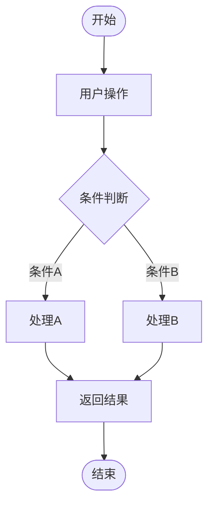
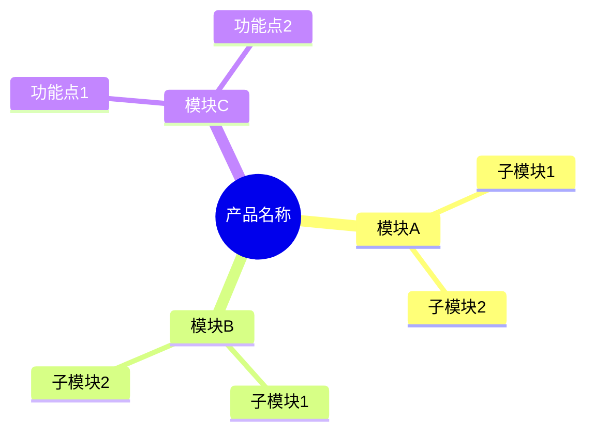
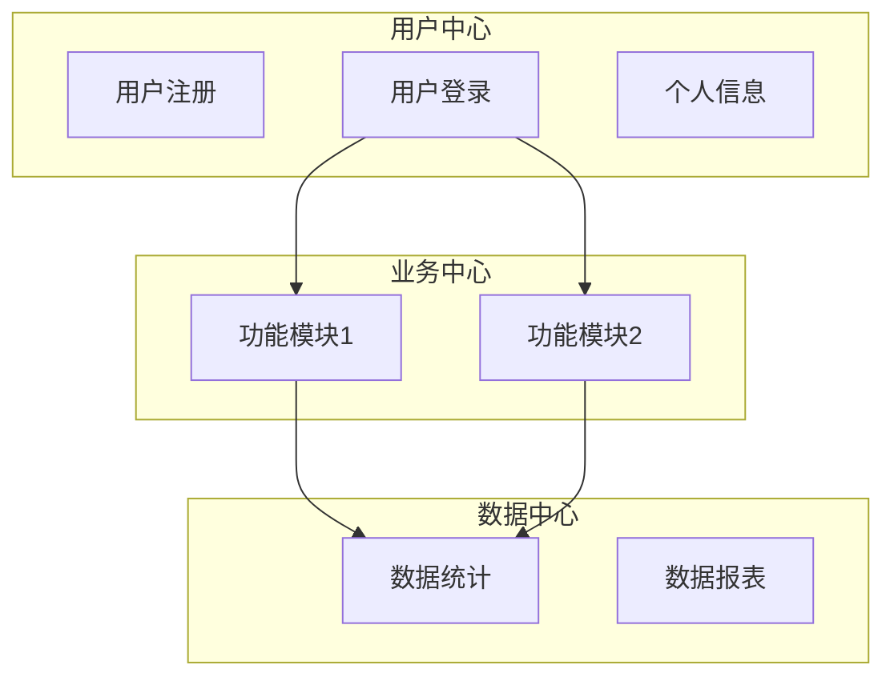
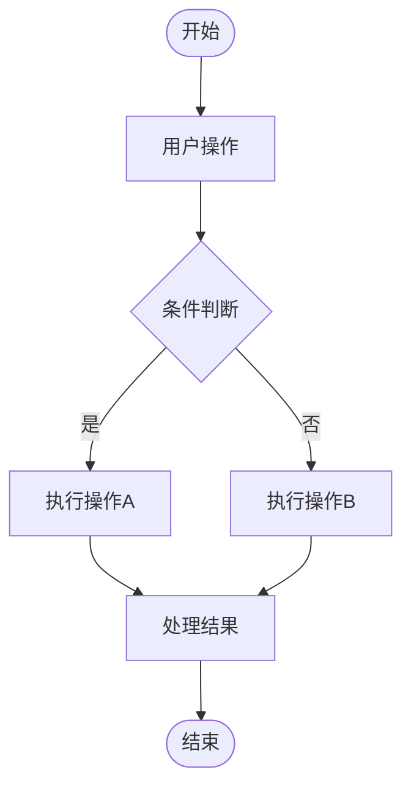
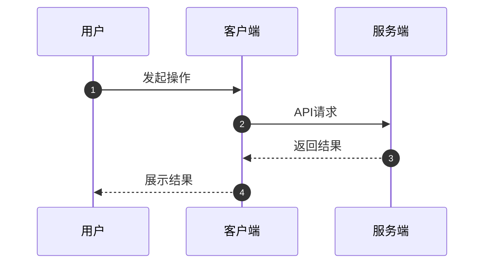
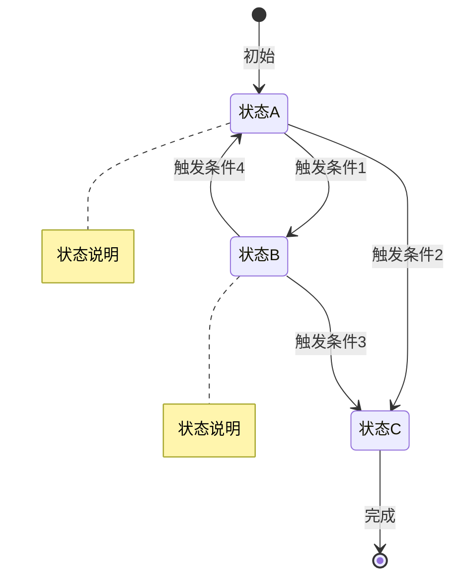
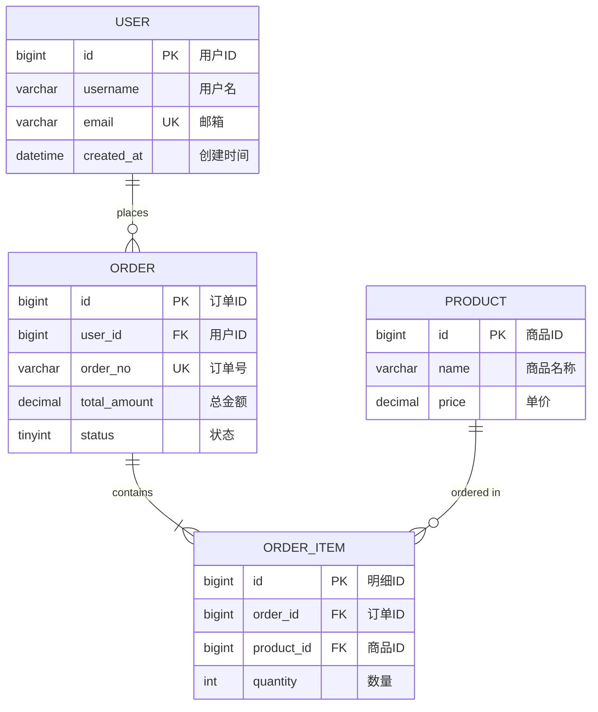

# 产品需求文档（PRD）模板

<!--
REQUIRED_SECTIONS:
  - 产品概述
  - 功能需求
  - 数据需求
REVIEW_CHECKPOINTS:
  - 功能编号可追溯
  - 状态枚举完整
  - 角色权限对应
-->

## 文档信息

**产品名称：** [产品名称]
**文档版本：** v1.0
**创建日期：** YYYY-MM-DD
**产品经理：** [姓名]
**状态：** 草稿/评审中/已确认

---

## 1. 产品概述

### 1.1 产品背景
[描述产品的市场背景和用户需求]

### 1.2 产品定位
[明确产品在市场中的定位]

### 1.3 目标用户
**主要用户：** [用户群体描述]
**用户画像：** [典型用户特征]

### 1.4 产品目标
- **业务目标：** [业务层面的目标]
- **用户目标：** [用户使用产品的目标]
- **技术目标：** [技术实现的目标]

---

## 2. 用户场景

### 2.1 用户旅程地图

**场景1：[场景名称]**
- **用户：** [角色描述]
- **目标：** [想要达成什么]
- **步骤：**
  1. [步骤1]
  2. [步骤2]
  3. [步骤3]
- **痛点：** [当前遇到的困难]
- **解决方案：** [产品如何解决]

**场景2：[场景名称]**
[同上结构]

### 2.2 用户故事

```
作为 [用户角色]
我想要 [功能/目标]
以便于 [价值/收益]
```

**用户故事列表：**
1. [用户故事1]
2. [用户故事2]
3. [用户故事3]

---

## 3. 功能需求

### 3.1 核心功能（P0 - MVP必需）

#### 3.1.1 [功能模块1]

**功能描述：**
[详细描述功能]

**用户价值：**
[说明对用户的价值]

**功能流程：**

> **图表要求**：使用**流程图**展示功能执行流程，推荐使用 Mermaid `flowchart` 语法。



**详细规则：**
- 规则1：[描述]
- 规则2：[描述]
- 规则3：[描述]

**界面要求：**
- **页面布局：** [描述]
- **交互方式：** [描述]
- **视觉设计：** [描述]

**数据要求：**
- **输入：** [需要的数据]
- **输出：** [展示的数据]
- **存储：** [保存的数据]

**异常处理：**
- 情况1：[异常描述] → 处理方式
- 情况2：[异常描述] → 处理方式

**验收标准：**
- [ ] 标准1：[描述]
- [ ] 标准2：[描述]
- [ ] 标准3：[描述]

#### 3.1.2 [功能模块2]
[同上结构]

### 3.2 重要功能（P1 - 重要但非紧急）

#### 3.2.1 [功能名称]
[简化描述，同上结构]

### 3.3 扩展功能（P2 - 可选功能）

#### 3.3.1 [功能名称]
[简化描述]

---

## 4. 产品架构

### 4.1 信息架构

> **图表要求**：使用**思维导图**表达产品信息结构，推荐使用 Mermaid `mindmap` 语法。

[描述产品的信息结构]



### 4.2 功能架构

> **图表要求**：使用**架构图**展示功能模块之间的关系，推荐使用 Mermaid `flowchart` 语法。



### 4.3 导航设计
[描述产品的导航结构]

---

## 5. 交互设计

### 5.1 交互流程

> **图表要求**：使用**流程图**或**时序图**展示关键功能的交互流程。复杂交互推荐使用 Mermaid `sequenceDiagram`，简单流程使用 `flowchart`。

**流程1：[流程名称]**



**复杂交互时序图示例：**



### 5.2 状态转换

> **图表要求**：使用**状态图**展示对象的状态流转，必须使用 Mermaid `stateDiagram-v2` 语法。



**状态说明表：**

| 状态名称 | 状态描述 | 允许操作 | 后续状态 |
|---------|---------|---------|---------|
| 状态A | [描述] | [操作列表] | [可达状态] |
| 状态B | [描述] | [操作列表] | [可达状态] |
| 状态C | [描述] | [操作列表] | [可达状态] |

### 5.3 操作反馈
[描述用户操作后的反馈方式]

- **成功反馈：** [描述]
- **失败反馈：** [描述]
- **加载反馈：** [描述]

---

## 6. 数据需求

### 6.1 数据模型

#### 实体1：[实体名称]
**字段定义：**

| 字段名 | 类型 | 必填 | 默认值 | 说明 |
|--------|------|------|--------|------|
| [字段1] | [类型] | 是/否 | [值] | [说明] |
| [字段2] | [类型] | 是/否 | [值] | [说明] |

**数据验证：**
- [验证规则1]
- [验证规则2]

### 6.2 数据ER图

#### 实体关系图



#### 实体说明

| 实体名称 | 中文名称 | 说明 | 数据量级 |
|---------|---------|------|---------|
| USER | 用户 | 系统用户信息 | 约[X]万 |
| ORDER | 订单 | 用户订单记录 | 约[X]万 |
| PRODUCT | 商品 | 商品基础信息 | 约[X]万 |
| ORDER_ITEM | 订单明细 | 订单商品明细 | 约[X]万 |

#### 关系说明

| 关系名称 | 源实体 | 目标实体 | 关系类型 | 说明 |
|---------|--------|---------|---------|------|
| 下单 | USER | ORDER | 1:N | 一个用户可下多个订单 |
| 包含 | ORDER | ORDER_ITEM | 1:N | 一个订单包含多个明细 |
| 购买 | PRODUCT | ORDER_ITEM | 1:N | 一个商品可在多个明细中 |

### 6.3 数据统计

**统计指标：**
- 指标1：[名称] - [计算方法]
- 指标2：[名称] - [计算方法]

### 6.4 数据报表

**报表1：[报表名称]**
- **用途：** [说明]
- **维度：** [统计维度]
- **指标：** [统计指标]
- **频次：** [生成频次]

---

## 7. 非功能需求

### 7.1 性能需求
- **页面加载：** ≤ [X]秒
- **接口响应：** ≤ [X]毫秒
- **并发支持：** ≥ [X]用户

### 7.2 兼容性需求

**平台支持：**
- iOS：[版本要求]
- Android：[版本要求]
- Web：[浏览器要求]

**设备支持：**
- 手机：[要求]
- 平板：[要求]
- PC：[要求]

### 7.3 安全需求
- **数据安全：** [要求]
- **用户隐私：** [要求]
- **访问控制：** [要求]

### 7.4 可用性需求
- **易用性：** [要求]
- **可访问性：** [要求]
- **国际化：** [要求]

---

## 8. 用户体验

### 8.1 视觉设计

**设计原则：**
- 原则1：[描述]
- 原则2：[描述]

**设计风格：**
- 色彩：[主色调]
- 字体：[字体方案]
- 图标：[图标风格]

### 8.2 内容策略

**文案规范：**
- 标题：[规范]
- 正文：[规范]
- 提示：[规范]

**内容更新：**
- 更新频次：[说明]
- 更新机制：[说明]

---

## 9. 分析与监控

### 9.1 数据埋点

**埋点需求：**

| 事件名称 | 触发条件 | 参数 | 用途 |
|---------|---------|------|------|
| [事件1] | [条件] | [参数] | [用途] |
| [事件2] | [条件] | [参数] | [用途] |

### 9.2 分析指标

**核心指标（北极星指标）：**
- [指标名称]：[定义和计算方法]

**关键指标：**
- [指标1]：[定义]
- [指标2]：[定义]
- [指标3]：[定义]

### 9.3 监控告警

**监控项：**
- [监控项1]：[阈值]
- [监控项2]：[阈值]

---

## 10. 发布计划

### 10.1 版本规划

**V1.0（MVP版本）**
- **发布时间：** [日期]
- **核心功能：** [列表]
- **目标：** [说明]

**V1.1（迭代版本）**
- **发布时间：** [日期]
- **新增功能：** [列表]

### 10.2 灰度发布

**灰度策略：**
- **灰度范围：** [说明]
- **灰度比例：** [百分比]
- **灰度时间：** [时长]

### 10.3 上线检查

**上线前检查：**
- [ ] 功能测试完成
- [ ] 性能测试通过
- [ ] 安全审核通过
- [ ] 文档更新完成

---

## 11. 成功指标

### 11.1 业务指标
- [ ] [指标1]：[目标值]
- [ ] [指标2]：[目标值]

### 11.2 产品指标
- [ ] [指标1]：[目标值]
- [ ] [指标2]：[目标值]

### 11.3 用户指标
- [ ] [指标1]：[目标值]
- [ ] [指标2]：[目标值]

---

## 附录

### A. 竞品分析
[列出竞品和分析结果]

### B. 用户调研
[用户调研的结论]

### C. 设计稿
[设计稿链接或附件]

### D. 变更历史

| 版本 | 日期 | 变更内容 | 变更人 |
|-----|------|---------|--------|
| v1.0 | YYYY-MM-DD | 初始版本 | [姓名] |

---

**产品经理：** [姓名]
**设计师：** [姓名]
**开发负责人：** [姓名]
**最后更新：** YYYY-MM-DD
