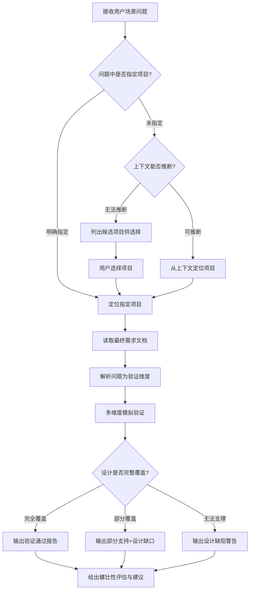

# 系统设计方案验证器

## 核心理念

**用户问题是设计验证的测试用例**——每一个业务场景问题，都是对系统设计方案的一次"模拟测试"。通过追踪问题在数据模型、业务流程、状态流转中的处理路径，验证设计方案的完整性和健壮性。

**最终文档是唯一裁决依据**——仅以 `documents/` 目录下的正式需求文档（PRD/BRD/TRD/SRS/DRD）作为验证依据，排除所有草稿、调研记录等过程性文档。

---

## 触发条件

TRIGGER when 用户提出需要验证设计覆盖能力的场景问题：

| 问题类型 | 典型示例 | 验证重点 |
|---------|---------|---------|
| **并发场景** | "多人同时操作XX会怎样" | 数据隔离、并发控制、锁机制 |
| **边界条件** | "库存不足时还能下单吗" | 校验规则、异常处理、状态约束 |
| **状态流转** | "订单超时未支付怎么处理" | 状态机完整性、超时机制 |
| **数据关联** | "删除主数据时关联数据如何处理" | 级联规则、数据完整性 |
| **权限边界** | "普通用户能否看到XX数据" | 权限矩阵、数据隔离 |
| **异常恢复** | "审批流程中断后如何继续" | 异常处理、补偿机制 |

---

## 执行流程



---

## 详细流程

### 第一步：项目识别

项目识别遵循以下优先级：

#### 1.1 显式指定

用户在问题中明确提及项目名称：
- "关于WMS系统，如果多人同时出库..."
- "在CRM项目中，客户合并后数据如何处理..."

**处理方式**：直接在 `.yg-pm/projects/` 目录下查找匹配项目。

#### 1.2 上下文推断

问题未明确指定，但从以下线索推断：

| 推断线索 | 示例 |
|---------|------|
| 业务术语 | "报工"、"工单" → 生产/MES类项目 |
| 功能关键词 | "订单审批"、"库存预警" → ERP类项目 |
| 会话历史 | 最近讨论的项目 |
| 唯一项目 | 只有一个活跃项目时自动选择 |

#### 1.3 用户选择

既未指定也无法推断时：

1. 列出 `.yg-pm/projects/` 下所有状态为 `active` 或 `in_progress` 的项目
2. 使用 AskUserQuestion 让用户选择

---

### 第二步：读取最终需求文档

**核心原则：仅使用最终版本的需求文档作为验证依据**

#### 2.1 有效文档类型（仅限以下类型）

| 文档类型 | 标识符 | 验证价值 |
|---------|--------|---------|
| **PRD** | 产品需求文档 | 功能定义、业务规则、用户场景 |
| **BRD** | 业务需求文档 | 业务目标、业务流程 |
| **TRD** | 技术需求文档 | 数据模型、接口设计、技术约束 |
| **SRS** | 软件需求规格说明书 | 完整的功能与非功能需求 |
| **DRD** | 数据需求文档 | 数据字典、数据关系、数据流转 |

#### 2.2 排除的文档类型

以下文档**不得作为验证依据**：
- ❌ `drafts/` 目录下的所有文档（草稿、工作稿）
- ❌ 需求调研记录、访谈记录（原始输入，非设计输出）
- ❌ 会议纪要、讨论记录（决策过程，非最终设计）
- ❌ 原型设计说明、UI规范（视觉层面，非逻辑层面）
- ❌ 参考文档、行业资料（外部信息，非本项目设计）

#### 2.3 文档检索范围

```
.yg-pm/projects/{项目名}/documents/
├── PRD-*.md          ✅ 产品需求文档
├── BRD-*.md          ✅ 业务需求文档
├── TRD-*.md          ✅ 技术需求文档
├── SRS-*.md          ✅ 软件需求规格
├── DRD-*.md          ✅ 数据需求文档
└── 其他正式文档.md    ⚠️ 需确认是否为最终版本
```

使用 Glob 工具检索：
```
.yg-pm/projects/{项目名}/documents/{PRD,BRD,TRD,SRS,DRD}-*.md
```

---

### 第三步：解析问题为验证维度

将用户的场景问题解析为多个验证维度：

#### 3.1 六大验证维度

| 验证维度 | 验证内容 | 适用问题类型 |
|---------|---------|-------------|
| **1. 数据模型** | 表结构是否能存储和查询该场景的数据 | 数据关联、数据完整性、并发场景 |
| **2. 业务流程** | 流程定义是否覆盖该场景的处理路径 | 操作流程、审批流程、异常流程 |
| **3. 状态机** | 状态流转是否能处理该场景的状态变化 | 状态流转、超时处理、异常恢复 |
| **4. 权限控制** | 权限设计是否能正确控制该场景的操作 | 权限边界、数据隔离、操作授权 |
| **5. 校验规则** | 业务规则是否能正确校验该场景的输入 | 边界条件、数据校验、约束检查 |
| **6. 异常处理** | 是否定义了该场景异常情况的处理方式 | 异常恢复、补偿机制、错误处理 |

#### 3.2 问题解析示例

**用户问题**：
> "如果多人同时对同一工单报工，系统如何处理？"

**解析为验证维度**：

```yaml
验证维度分析:
  数据模型:
    - 工单表是否有并发控制字段？
    - 报工记录如何关联工单和人员？
    - 是否有锁机制防止重复报工？

  业务流程:
    - 报工流程是否定义了并发场景？
    - 多人报工的时序如何处理？

  状态机:
    - 工单状态是否受报工人数影响？
    - 多人报工后工单状态如何变化？

  权限控制:
    - 是否所有有权限的人都能报工？
    - 是否有报工人数限制？

  校验规则:
    - 是否校验工单状态允许报工？
    - 是否校验人员未重复报工？

  异常处理:
    - 并发冲突如何处理？
    - 部分报工失败如何回滚？
```

---

### 第四步：多维度模拟验证

**核心方法：像运行测试用例一样追踪设计文档**

#### 4.1 验证执行方式

对每个验证维度，在最终需求文档中追踪处理路径：

**验证模板**：
```
验证维度：{维度名称}
验证目标：{该维度要验证什么}
文档追踪：
  - 检索关键词：{关键词列表}
  - 匹配文档：{文档名称}
  - 证据定位：{章节/段落}

验证结果：
  ✅ 完整定义 | ⚠️ 部分定义 | ❌ 未定义

证据链：
  > 📄 {文档名称}：
  > {引用原文}
```

#### 4.2 验证维度执行详解

**维度1：数据模型验证**

追踪数据如何在表结构中存储、关联、查询：

```
验证问题：多人报工数据如何存储和隔离？

检索目标：
  - 表结构定义（TRD/DRD）
  - ER图/数据关系
  - 字段定义

验证追踪：
  Q1: 报工记录存储在哪里？
  → 检索 work_report / report_record 表

  Q2: 如何关联人员和工单？
  → 检索 user_id / worker_id 字段
  → 检索 order_id / work_order_id 字段

  Q3: 是否有并发控制？
  → 检索 version / lock_version 字段
  → 检索 unique 约束
```

**维度2：业务流程验证**

追踪业务流程是否能处理该场景：

```
验证问题：报工流程是否支持多人同时操作？

检索目标：
  - 业务流程定义（PRD/BRD）
  - 流程图/时序图
  - 操作步骤说明

验证追踪：
  Q1: 报工流程步骤是什么？
  → 检索"报工流程"、"报工步骤"

  Q2: 流程中是否考虑多人场景？
  → 检索"同时"、"并发"、"多人"

  Q3: 流程是否有分支处理不同情况？
  → 检索条件分支、异常分支
```

**维度3：状态机验证**

追踪状态流转是否完整：

```
验证问题：多人报工后工单状态如何变化？

检索目标：
  - 状态定义（PRD）
  - 状态流转图/状态机
  - 状态变化触发条件

验证追踪：
  Q1: 工单有哪些状态？
  → 检索"工单状态"、"订单状态"

  Q2: 什么条件触发状态变化？
  → 检索状态转换条件

  Q3: 多人报工是否触发状态变化？
  → 检索"报工"与"状态变化"的关联
```

**维度4：权限控制验证**

追踪权限是否能正确控制该场景：

```
验证问题：谁可以报工？是否有数量限制？

检索目标：
  - 角色定义（PRD）
  - 权限矩阵
  - 数据权限规则

验证追踪：
  Q1: 哪些角色可以报工？
  → 检索"报工权限"、"操作权限"

  Q2: 是否有人数限制？
  → 检索"限制"、"上限"

  Q3: 是否有数据隔离？
  → 检索"数据权限"、"可见范围"
```

**维度5：校验规则验证**

追踪业务规则是否能正确校验：

```
验证问题：如何防止重复报工或非法报工？

检索目标：
  - 业务规则（PRD）
  - 校验规则
  - 约束条件

验证追踪：
  Q1: 报工有哪些前置条件？
  → 检索"报工条件"、"前置校验"

  Q2: 是否校验人员唯一性？
  → 检索"重复"、"唯一"

  Q3: 是否校验工单状态？
  → 检索"状态校验"、"条件检查"
```

**维度6：异常处理验证**

追踪异常情况是否有定义处理方式：

```
验证问题：并发冲突或部分失败如何处理？

检索目标：
  - 异常处理（PRD/TRD）
  - 错误处理
  - 补偿机制

验证追踪：
  Q1: 定义了哪些异常情况？
  → 检索"异常"、"错误"、"失败"

  Q2: 并发冲突如何处理？
  → 检索"并发"、"冲突"、"锁"

  Q3: 是否有补偿或回滚机制？
  → 检索"补偿"、"回滚"、"撤销"
```

---

### 第五步：输出结构化验证报告

**核心原则：结论先行，证据支撑，建议结尾**

#### 5.1 报告结构模板

```markdown
## 设计验证报告

**验证场景**：{用户提出的问题场景}
**所属项目**：{项目名称}
**验证依据**：{使用的最终需求文档列表}

---

### 📋 验证结论

{✅ 设计完全覆盖 / ⚠️ 设计部分覆盖 / ❌ 设计存在缺陷}

{一句话概括：系统能否处理该场景，主要问题或风险是什么}

---

### 🔍 验证路径

#### 1️⃣ 数据模型验证

**验证结果**：✅ 完整支持 / ⚠️ 部分支持 / ❌ 未定义

**处理路径**：
{描述数据如何在表结构中流转，支持或限制了什么}

**文档证据**：
> 📄 {文档名称}（{章节}）：
> {关键原文引用}

---

#### 2️⃣ 业务流程验证

**验证结果**：{...}

**处理路径**：
{描述流程如何处理该场景}

**文档证据**：
> 📄 {...}

---

#### 3️⃣ 状态机验证

**验证结果**：{...}

**状态流转路径**：
{状态A} → {触发条件} → {状态B} → ...

**文档证据**：
> 📄 {...}

---

#### 4️⃣ 权限控制验证

**验证结果**：{...}

**权限约束**：
{哪些角色可以操作，有什么限制}

**文档证据**：
> 📄 {...}

---

#### 5️⃣ 校验规则验证

**验证结果**：{...}

**校验逻辑**：
{前置条件、约束规则}

**文档证据**：
> 📄 {...}

---

#### 6️⃣ 异常处理验证

**验证结果**：{...}

**异常处理方式**：
{如何处理异常情况}

**文档证据**：
> 📄 {...}

---

### ⚠️ 设计缺陷清单

{如果存在设计缺陷}

| # | 缺陷类型 | 缺失内容 | 严重程度 | 影响分析 |
|---|---------|---------|---------|---------|
| 1 | 🔴 缺失 | {未定义什么} | P0 | {会导致什么后果} |
| 2 | 🟡 模糊 | {什么定义不清晰} | P1 | {可能引发什么问题} |

---

### 💡 健壮性评估与建议

**整体评估**：
{对设计健壮性的总体评价}

**改进建议**：
1. {针对发现问题的具体建议}
2. {...}

**补充验证建议**：
{如果需要进一步验证其他相关场景}
```

#### 5.2 不同验证结果的输出策略

**✅ 设计完全覆盖**

- 总结各维度的支持情况
- 描述完整的处理路径
- 可补充优化建议

**⚠️ 设计部分覆盖**

- 明确哪些维度有定义，哪些缺失
- 分析缺失维度可能的影响
- 给出补充设计的建议

**❌ 设计存在缺陷**

- 重点说明关键缺失或矛盾
- 分析业务影响和风险
- 建议优先补充的内容

---

## 设计缺陷分类

### 缺陷类型定义

| 类型 | 标识 | 定义 | 示例 |
|-----|-----|------|------|
| **缺失** | 🔴 | 完全没有定义 | 未定义并发控制机制 |
| **矛盾** | 🔴 | 多处描述冲突 | A文档定义必填，B文档定义可空 |
| **断层** | 🔴 | 功能与数据不匹配 | 功能需展示X，但表结构无X字段 |
| **模糊** | 🟡 | 描述不清晰 | "相关人员审批"未明确是谁 |
| **遗漏** | 🟡 | 常见场景未覆盖 | 未定义重复提交的处理 |

### 严重程度分级

| 级别 | 标识 | 影响 | 处理建议 |
|-----|-----|------|---------|
| **P0** | 🔴 | 核心功能无法实现或数据不一致 | 必须立即修复 |
| **P1** | 🟡 | 功能可运行但存在隐患或风险 | 开发前应修复 |
| **P2** | 🟢 | 体验或扩展性问题 | 可后续优化 |

---

## 验证规范

### 必须遵守

- ✅ **必须使用最终需求文档**：仅限 PRD/BRD/TRD/SRS/DRD
- ✅ **必须标注文档来源**：每个结论都要引用具体文档和章节
- ✅ **必须多维度验证**：至少覆盖数据模型、业务流程、状态机三个维度
- ✅ **必须结论先行**：先给出能否处理的明确结论

### 禁止行为

- ❌ **禁止使用草稿文档**：drafts/ 下的文档不能作为依据
- ❌ **禁止主观推断**：文档未定义的内容不能给出确定回答
- ❌ **禁止忽略设计缺口**：发现缺失必须明确指出
- ❌ **禁止模糊结论**：不能使用"可能支持"、"应该可以"等模糊表述

---

## 示例场景

### 示例：并发操作场景验证

**用户提问**：
> "如果多人同时对同一工单报工，系统如何处理？"

**项目识别**：关键词"报工" → MES生产执行系统

**读取最终需求文档**：
- PRD-生产报工管理.md
- TRD-数据库设计.md
- TRD-接口设计.md

**验证执行**：

#### 1️⃣ 数据模型验证

```
检索：报工表结构、工单表结构、关联字段

发现证据：
> 📄 TRD-数据库设计.md（3.2.1 报工记录表）：
> work_report 表包含字段：
> - id (PK)
> - work_order_id (FK, NOT NULL) -- 关联工单
> - user_id (FK, NOT NULL) -- 关联报工人员
> - work_hours (DECIMAL, NOT NULL) -- 工时
> - report_time (DATETIME, NOT NULL) -- 报工时间
>
> 约束：UNIQUE(work_order_id, user_id) -- 每人每工单只能报工一次

验证结果：✅ 数据模型支持多人报工，且有唯一约束防止重复
```

#### 2️⃣ 业务流程验证

```
检索：报工流程、并发处理

发现证据：
> 📄 PRD-生产报工管理.md（4.1 报工流程）：
> 1. 员工扫描工单二维码
> 2. 系统校验工单状态（必须为"进行中"）
> 3. 系统校验员工是否已报工
> 4. 填写工时，提交报工
> 5. 系统记录报工信息

验证结果：✅ 流程定义了重复报工校验
```

#### 3️⃣ 状态机验证

```
检索：工单状态、状态流转条件

发现证据：
> 📄 PRD-生产报工管理.md（3.3 工单状态）：
> 工单状态：待开工 → 进行中 → 已完成 → 已关闭
>
> 状态变化条件：
> - 待开工 → 进行中：首次报工时自动变更
> - 进行中 → 已完成：报工总工时达到计划工时

验证结果：⚠️ 未定义多人同时首次报工时状态如何变化
```

**输出验证报告**：

```markdown
## 设计验证报告

**验证场景**：多人同时对同一工单报工
**所属项目**：MES生产执行系统
**验证依据**：PRD-生产报工管理.md, TRD-数据库设计.md

---

### 📋 验证结论

⚠️ 设计部分覆盖

系统能支持多人报工的基本场景，但在状态流转的并发处理上存在设计缺口。

---

### 🔍 验证路径

#### 1️⃣ 数据模型验证
**验证结果**：✅ 完整支持
**处理路径**：work_report表通过(user_order_id, user_id)唯一约束，确保每人在每工单只能报工一次。多人报工记录独立存储，通过user_id字段隔离。

#### 2️⃣ 业务流程验证
**验证结果**：✅ 完整支持
**处理路径**：报工流程第3步明确校验"员工是否已报工"，可防止重复提交。

#### 3️⃣ 状态机验证
**验证结果**：⚠️ 部分支持
**状态流转路径**：待开工 → 进行中（首次报工触发）
**问题**：未定义多人同时首次报工时的状态变更逻辑，可能导致状态不一致。

---

### ⚠️ 设计缺陷清单

| # | 缺陷类型 | 缺失内容 | 严重程度 | 影响分析 |
|---|---------|---------|---------|---------|
| 1 | 🟡 模糊 | 并发首次报工的状态变更逻辑 | P1 | 可能导致工单状态不一致 |

---

### 💡 健壮性评估与建议

**整体评估**：设计基本健壮，数据层有完整的并发控制，但在状态层存在潜在风险。

**改进建议**：
1. 明确定义并发首次报工的处理规则，建议使用数据库锁或乐观锁机制
2. 可考虑将状态变更改为异步处理，由后台任务统一更新

**补充验证建议**：
- 验证"报工撤销"场景的设计覆盖
- 验证"工时超限"场景的处理逻辑
```

---

## 与其他技能的关系

| 技能 | 关系说明 |
|------|---------|
| yg-brainstorming | 本技能不参与需求探索阶段 |
| yg-document-writing | 发现设计缺陷后可调用此技能补充文档 |
| yg-requirement-reviewer | 本技能从单一场景出发，审查员从整体架构出发 |

### 触发时机

- 在 `yg-document-writing` 完成后，验证文档设计的完整性
- 在开发过程中，验证设计方案对具体场景的覆盖
- 在需求评审时，作为场景验证的工具

---

## 渐进式披露结构

```
yg-question/
├── SKILL.md                    # 主文件（本文档）
└── references/                 # 参考文件
    └── verification-checklist.md  # 各维度验证检查清单
```