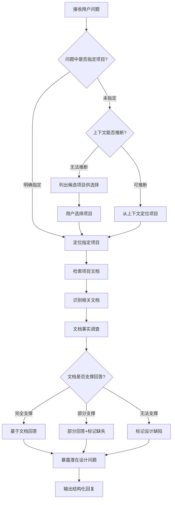

# 基于文档的智能问答与设计缺陷检测

## 核心理念

**文档是唯一事实来源**——所有回答必须基于项目文档，而非推测或假设。当文档无法支撑回答时，这本身就是设计缺陷的信号。

**提问即检测**——每一个用户问题都是对产品设计的一次检验。通过严谨的文档调查过程，暴露设计中可能存在的遗漏、矛盾或模糊之处。

---

## 触发条件

TRIGGER when 用户提出以下类型的问题：
- 功能实现类："如何实现XX功能？"、"XX功能怎么操作？"
- 能力边界类："系统是否支持XX？"、"能不能做到XX？"
- 业务场景类："如果XX情况，系统如何处理？"、"多人同时操作会怎样？"
- 数据查询类："如何查询XX记录？"、"数据怎么关联？"
- 权限流程类："谁可以操作XX？"、"XX流程怎么走？"

---

## 执行流程



---

## 详细流程

### 第一步：项目识别

项目识别遵循以下优先级：

#### 1.1 显式指定

用户在问题中明确提及项目名称：
- "关于WMS系统，如果多人报工..."
- "在CRM项目中，如何查询..."
- "电商平台的订单状态..."

**处理方式**：直接在 `.yg-pm/projects/` 目录下查找匹配项目。

#### 1.2 上下文推断

问题未明确指定，但从以下线索推断：

| 推断线索 | 示例 |
|---------|------|
| 业务术语 | "报工"、"工单" → 生产/MES类项目 |
| 功能关键词 | "订单审批"、"库存预警" → ERP类项目 |
| 会话历史 | 最近讨论的项目 |
| 唯一项目 | 只有一个活跃项目时自动选择 |

**处理方式**：分析问题关键词，匹配项目文档中的业务术语。

#### 1.3 用户选择

既未指定也无法推断时：

1. 列出 `.yg-pm/projects/` 下所有状态为 `active` 或 `in_progress` 的项目
2. 使用 AskUserQuestion 让用户选择

**输出格式**：
```
检测到多个候选项目，请选择：

1. WMS仓库管理系统 [active]
2. MES生产执行系统 [in_progress]
3. CRM客户管理 [active]

请输入序号或项目名称。
```

---

### 第二步：文档检索

确定项目后，检索相关文档：

#### 2.1 文档来源优先级

| 优先级 | 文档类型 | 目录 | 说明 |
|-------|---------|------|------|
| P0 | PRD/需求设计文档 | `documents/` | 功能定义的权威来源 |
| P0 | 表结构设计 | `documents/` | 数据模型的唯一依据 |
| P1 | 业务流程文档 | `documents/` | 流程与规则的来源 |
| P1 | 权限设计文档 | `documents/` | 角色权限的定义 |
| P2 | 需求调研记录 | `drafts/` | 用户需求的原始记录 |
| P2 | 原型设计说明 | `prototypes/` | 交互细节的补充 |
| P3 | 会议纪要/讨论记录 | `drafts/` | 决策背景参考 |

#### 2.2 文档匹配策略

根据问题类型选择检索策略：

| 问题类型 | 主要检索目标 | 辅助检索 |
|---------|------------|---------|
| 功能实现类 | 功能点列表、表结构 | 业务流程 |
| 能力边界类 | 功能点列表、非功能需求 | 权限设计 |
| 业务场景类 | 业务流程、表结构 | 状态流转图 |
| 数据查询类 | 表结构、数据字典 | ER图 |
| 权限流程类 | 权限矩阵、业务流程 | 角色定义 |

#### 2.3 检索执行

使用 Grep 工具搜索关键词：
- 功能名称、表名、字段名
- 状态值、角色名称
- 业务术语

**示例检索命令**：
```bash
# 检索功能点
grep -r "报工" .yg-pm/projects/{project}/documents/

# 检索表结构
grep -r "report_record\|work_report" .yg-pm/projects/{project}/documents/
```

---

### 第三步：文档事实调查

**核心理念：像审计员一样调查，像律师一样论证**

#### 3.1 调查方法论

**SEAR原则**（严谨证据推理）：
- **S**ource：每个结论必须标注文档来源
- **E**vidence：引用原文内容作为证据
- **A**nalysis：基于证据进行分析推理
- **R**esult：得出明确结论

#### 3.2 调查过程

对每个问题执行以下步骤：

**Step 1：问题分解**

将复杂问题拆解为子问题：
```
原问题："如果多人报工，如何查询每个人的报工记录？"

分解：
Q1: 系统是否支持多人报工？（能力确认）
Q2: 报工数据存储在哪些表？（数据模型）
Q3: 报工记录包含哪些字段？（数据粒度）
Q4: 如何按人员筛选查询？（查询条件）
Q5: 查询结果如何展示？（输出格式）
```

**Step 2：逐项调查**

对每个子问题进行文档检索和验证：

```
Q1: 系统是否支持多人报工？

检索文档：PRD-生产报工管理.md
发现证据：
> "3.2 报工功能：支持同一工单多人协作报工，每人独立记录工时。"

结论：✅ 文档明确支持多人报工
来源：PRD-生产报工管理.md 第3.2节
```

**Step 3：交叉验证**

从多个文档验证同一事实：
```
验证点：报工记录是否包含人员标识

证据A（表结构）：
> work_report表包含字段：user_id (INT, NOT NULL, 关联用户表)

证据B（功能描述）：
> 每条报工记录关联具体操作人员

证据C（原型设计）：
> 报工列表默认显示"操作人"列

交叉验证：✅ 三处文档一致确认
```

**Step 4：缺口识别**

当文档无法完全支撑时，识别设计缺口：

```
Q4: 如何按人员筛选查询？

检索结果：
- PRD中未明确提及"按人员筛选"功能
- 表结构有user_id字段，数据层面可支持
- 原型设计中查询条件区域未包含"人员"选项

判定：⚠️ 设计缺口
- 数据模型支持（有user_id字段）
- 功能设计缺失（未定义筛选入口）
- 建议：在查询条件中增加"操作人员"筛选
```

---

### 第四步：设计缺陷检测

**每个问题都是一次设计审查**

#### 4.1 缺陷类型识别

| 缺陷类型 | 定义 | 示例 |
|---------|------|------|
| 🔴 **缺失** | 文档中完全没有定义 | 没有定义异常处理流程 |
| 🔴 **矛盾** | 多处描述相互冲突 | A文档说"必填"，B文档说"可空" |
| 🟡 **模糊** | 描述不清晰，存在歧义 | "相关人员进行审批"未明确谁 |
| 🟡 **断层** | 功能定义了，但数据未支撑 | 功能要展示X，表结构无X字段 |
| 🟢 **待优化** | 设计合理但可改进 | 可增加XX提升用户体验 |

#### 4.2 缺陷严重程度评估

| 级别 | 影响 | 处理优先级 |
|-----|------|----------|
| 🔴 P0 | 核心功能无法实现或数据不一致 | 阻塞开发，必须修复 |
| 🟡 P1 | 功能可运行但存在隐患 | 建议在开发前修复 |
| 🟢 P2 | 体验或扩展性问题 | 可后续优化 |

#### 4.3 缺陷报告格式

```markdown
### 缺陷发现：[缺陷标题]

**类型**：🔴 缺失 / 🔴 矛盾 / 🟡 模糊 / 🟡 断层 / 🟢 待优化
**严重程度**：P0 / P1 / P2
**发现位置**：[在回答哪个问题时发现]

**问题描述**：
[具体说明问题是什么]

**文档证据**：
- 📄 文档A：[引用内容]
- 📄 文档B：[引用内容]（如有矛盾）

**影响分析**：
[这个问题会导致什么后果]

**建议方案**：
[如何修复这个问题]
```

---

### 第五步：输出回复

#### 5.1 回复结构模板

```markdown
## 问题回答：[问题摘要]

**项目**：{项目名称}
**调查范围**：{检索了哪些文档}

---

### 📋 回答摘要

{用2-3句话概括核心回答}

---

### 🔍 详细调查结果

#### Q1: {子问题1}

**结论**：✅ 明确支持 / ⚠️ 部分支持 / ❌ 不支持

**文档证据**：
> 📄 {文档名称}：
> {引用原文}

**分析说明**：
{基于证据的分析推理}

---

#### Q2: {子问题2}
...

---

### ⚠️ 发现的设计问题

{如果有发现设计缺陷，在此列出}

| # | 问题 | 严重程度 | 影响 |
|---|------|---------|------|
| 1 | [问题描述] | P0/P1/P2 | [影响说明] |

---

### 💡 建议

{针对问题的建议，或对设计的改进建议}

---

### 📚 参考文档

- 📄 [文档名称](文档路径) - 引用章节
- 📄 [文档名称](文档路径) - 引用章节
```

#### 5.2 不同场景的回复策略

**场景一：文档完全支撑**

直接给出明确回答，展示文档证据链，可适当补充分析。

**场景二：文档部分支撑**

- 先回答有文档支撑的部分
- 明确标注哪些部分文档未定义
- 给出合理推断但标注为"推断"
- 建议补充文档

**场景三：文档无法支撑**

- 明确说明文档未定义
- 分析这可能意味着什么（功能未设计？遗漏？）
- 给出建议的调查方向或设计建议
- 标记为设计缺陷

---

## 回复规范

### 禁止事项

- ❌ **禁止凭空回答**：没有文档依据时不得给出确定回答
- ❌ **禁止脑补功能**：不能假设系统有文档未提及的功能
- ❌ **禁止忽略矛盾**：发现文档矛盾时必须指出
- ❌ **禁止使用模糊来源**：如"根据设计"、"一般来说"

### 必须事项

- ✅ **必须标注来源**：每个结论都要标注文档出处
- ✅ **必须引用原文**：使用引用格式展示文档内容
- ✅ **必须说明调查过程**：让用户了解你是如何得出结论的
- ✅ **必须指出缺口**：文档不足时必须明确指出

---

## 项目上下文读取

在开始调查前，需要了解项目的完整上下文。

### 项目元数据读取

读取 `.yg-pm/projects/{项目名}/project.json`：
- 项目ID、名称
- 项目阶段（stage）
- 已有文档列表
- 最近更新时间

### 文档清单获取

```
.yg-pm/projects/{项目名}/
├── project.json
├── drafts/              # 草稿文档
│   └── *.md
├── documents/           # 正式文档
│   ├── PRD-*.md
│   ├── TRD-*.md
│   └── *.md
└── prototypes/          # 原型设计
    └── *.md
```

使用 Glob 工具获取文档列表，然后根据问题类型选择优先阅读的文档。

---

## 示例场景

### 示例1：功能实现类问题

**用户提问**：
> "如果多人报工，如何查询每个人的报工记录？"

**执行过程**：

1. **项目识别**：关键词"报工" → 匹配到 MES生产执行系统
2. **文档检索**：
   - 检索 `documents/PRD-生产报工管理.md`
   - 检索 `documents/TRD-数据库设计.md`
   - 检索 `documents/权限设计.md`
3. **事实调查**：
   - Q1: 多人报工支持？→ 文档明确支持
   - Q2: 数据如何存储？→ work_report表，有user_id字段
   - Q3: 如何查询？→ 发现设计缺口
4. **缺陷检测**：发现查询条件未定义人员筛选

**输出回复**：参见 `references/response-template.md` 中的完整示例。

---

### 示例2：能力边界类问题

**用户提问**：
> "系统支持批量导入订单吗？最多能导入多少条？"

**执行过程**：

1. **项目识别**：关键词"订单" → 匹配到 CRM系统
2. **文档检索**：
   - PRD中检索"导入"、"批量"
   - 非功能需求中检索"性能"、"数量限制"
3. **事实调查**：
   - 功能支持：PRD定义了批量导入功能
   - 数量限制：文档未定义上限
4. **缺陷检测**：非功能需求缺失性能边界定义

---

## 与其他技能的关系

| 技能 | 关系说明 |
|------|---------|
| yg-brainstorming | 本技能不参与需求探索阶段 |
| yg-requirement-reviewer | 相似的方法论，但本技能从用户问题出发 |
| yg-document-writing | 发现设计缺陷后可能需要补充文档 |

### 触发时机

- 在 `yg-brainstorming` 完成后
- 在 `yg-document-writing` 完成后
- 在任何有需求文档的项目中

---

## 下一步建议

完成问答后，如果发现设计缺陷，建议使用：
- `/yg-document-writing` - 补充缺失的文档内容
- `/yg-requirement-reviewer` - 进行全面的需求审查

---

## 参考文件

本技能包含以下参考文件，用于深入了解具体方法：

| 文件 | 说明 |
|------|------|
| `references/response-template.md` | 回复模板与完整示例 |
| `references/methodology.md` | 文档调查方法论详解 |

在执行复杂问题调查时，可参考 `references/methodology.md` 了解 SEAR 调查框架和问题分解技术。

---

## 渐进式披露结构

```
yg-question/
├── SKILL.md                    # 主文件（本文档）
└── references/                 # 参考文件
    ├── response-template.md    # 回复模板与示例
    └── methodology.md          # 调查方法论
```