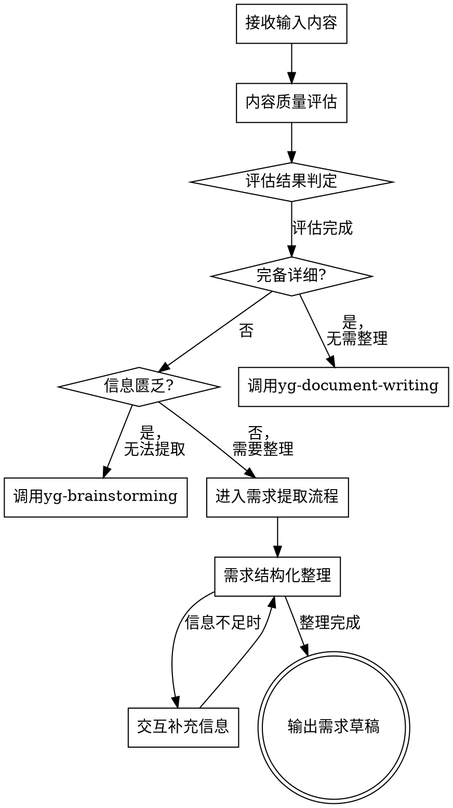

# 需求提取

## 技能定位

**核心目的**：将"杂乱分散"的碎片信息，按照统一规范的方法论进行需求提取，形成一份整理后的需求草稿。

**关键区别**：
| 对比项 | 需求提取 (本技能) | 正式需求文档 (PRD等) |
|-------|------------------|---------------------|
| 输出性质 | 需求草稿 | 正式文档 |
| 格式要求 | 灵活适配，无严格限制 | 规范格式，标准章节 |
| 目的 | 为正式文档准备基础资料 | 指导开发实施 |
| 适用场景 | 信息碎片、沟通记录、原始想法 | 成熟需求、评审通过 |

**遵循方法论但不拘泥格式**：需求整理的本质是根据用户信息适配，遵循需求整理、检查、总结的方法论，而非固定的大纲模板。

---

## 执行流程



---

## 一、输入内容接收

### 支持的输入类型

| 类型 | 说明 | 处理方式 |
|-----|------|---------|
| 会议纪要 | 项目会议、需求评审会等记录 | 提取关键决策和行动项 |
| 用户故事 | 用户角度的功能描述 | 结构化为需求条目 |
| 竞品分析 | 竞品功能对比分析 | 提取差异化需求 |
| 探索结果 | yg-brainstorming 输出 | 结构化整理 |
| 沟通记录 | 聊天记录、邮件往来 | 提取需求要点 |
| 现有文档 | 旧版需求文档、产品说明 | 整理规范化 |
| 碎片信息 | 零散的想法、口头描述 | 收集整理 |

### 输入源确认

**使用 AskUserQuestion 确认输入来源**：

```json
{
  "questions": [{
    "question": "您希望从哪种来源提取需求？",
    "header": "输入来源",
    "multiSelect": false,
    "options": [
      { "label": "会议纪要", "description": "从会议记录中提取关键决策和行动项" },
      { "label": "文档链接", "description": "从在线文档或本地文档中提取" },
      { "label": "沟通记录", "description": "直接粘贴的聊天记录或邮件内容" },
      { "label": "碎片信息", "description": "零散的想法或口头描述" }
    ]
  }]
}
```

---

## 二、内容质量评估

**关键环节**：在进入整理流程前，必须评估用户提供内容的质量，决定后续处理策略。

### 评估维度

| 维度 | 评估内容 | 权重 |
|-----|---------|------|
| **完整性** | 是否覆盖主要需求领域 | 40% |
| **清晰度** | 表述是否明确、无歧义 | 25% |
| **结构化** | 是否有良好的组织结构 | 20% |
| **可操作性** | 是否可转化为具体功能 | 15% |

### 评估等级

#### 等级 A：完备详细 ✓

**特征**：
- 内容覆盖完整的业务背景、功能需求、非功能需求
- 表述清晰，无重大歧义
- 已有一定的结构组织
- 可直接用于编写正式需求文档

**判定标准**：
- [ ] 包含明确的业务目标和背景
- [ ] 功能需求描述完整，有优先级划分
- [ ] 用户角色和权限清晰
- [ ] 数据实体和流程基本明确
- [ ] 非功能需求有所涉及

**应对策略**：直接调用 `/yg-document-writing`，引导用户创建正式需求文档。

---

#### 等级 B：需要整理 ○

**特征**：
- 有一定量的需求信息，但不完整或结构欠佳
- 部分表述模糊，需要澄清
- 缺少某些关键信息
- 通过交互补充可以形成完整需求

**判定标准**：
- [ ] 核心功能有描述，但细节不足
- [ ] 业务背景有提及，但不完整
- [ ] 存在模糊或歧义表述
- [ ] 缺少部分非功能需求

**应对策略**：进入需求提取流程，通过交互方式收集信息，生成需求整理文档。

---

#### 等级 C：信息匮乏 ✗

**特征**：
- 信息量严重不足，无法形成有意义的需求
- 仅有模糊的想法或概念
- 缺少核心业务场景描述
- 需要大量探索才能明确需求

**判定标准**：
- [ ] 无法识别明确的业务目标
- [ ] 功能需求描述过于笼统（如"要做一个管理系统"）
- [ ] 缺少用户场景和使用背景
- [ ] 信息量不足以支撑需求文档

**应对策略**：调用 `/yg-brainstorming`，与用户进行头脑风暴，收集完整需求后再进行整理。

---

### 评估结果处理

**使用 AskUserQuestion 确认评估结果和处理方式**：

```json
{
  "questions": [{
    "question": "根据评估，您提供的内容[评估结果描述]，建议如何处理？",
    "header": "处理方式",
    "multiSelect": false,
    "options": [
      { "label": "按建议处理(推荐)", "description": "根据评估结果选择最优路径" },
      { "label": "继续整理", "description": "即使信息不完整也尝试整理" },
      { "label": "补充信息", "description": "我先提供更多信息再处理" }
    ]
  }]
}
```

---

## 三、需求结构化整理

当评估结果为"需要整理"时，进入此流程。

### 分析维度

| 维度 | 分析内容 |
|-----|---------|
| 基本信息 | 客户名称、行业、背景、项目类型、规模 |
| 业务场景 | 核心业务流程、当前工作方式、使用场景 |
| 痛点问题 | 现有系统不足、效率瓶颈、数据管理困难 |
| 功能需求 | 核心功能（必需）、扩展功能（重要）、可选功能 |
| 非功能需求 | 性能要求、安全要求、兼容性要求 |
| 技术要求 | 平台集成、数据迁移、API接口需求 |
| 限制条件 | 预算、时间、资源、政策法规限制 |

### 需求提取技巧

#### 1. 识别关键信息

**关键词识别：**

| 类型 | 关键词 |
|-----|-------|
| 动作词 | 需要、想要、希望、必须、要求 |
| 问题词 | 问题、困难、痛点、不满、麻烦 |
| 功能词 | 功能、模块、系统、平台、工具 |
| 数据词 | 数据、信息、记录、统计、分析 |
| 时间词 | 期望、计划、期限、截止、周期 |

**优先级判断：**

| 级别 | 说明 | 判断标准 |
|-----|------|---------|
| P0（必需） | 必须实现 | 无此功能无法使用 |
| P1（重要） | 重要功能 | 影响核心流程 |
| P2（可选） | 锦上添花 | 可以后期迭代 |

#### 2. 消除歧义

**常见歧义及处理：**

| 歧义类型 | 示例 | 处理方式 |
|---------|------|---------|
| 模糊描述 | "需要方便一点" | 明确具体场景和操作 |
| 技术术语 | 专业名词 | 确认客户理解是否准确 |
| 功能冲突 | 需求矛盾 | 标注冲突点，需客户确认 |
| 范围不清 | 边界模糊 | 明确边界和限制条件 |

#### 3. 补充遗漏

**常见遗漏信息：**
- 用户角色和权限
- 数据量和性能要求
- 兼容性和集成需求
- 异常场景处理
- 培训和维护需求

## 四、交互补充信息

在整理过程中发现信息缺失时，使用 AskUserQuestion 收集补充信息。

### 信息缺失处理

```json
{
  "questions": [{
    "question": "文档中缺少明确的业务目标定义，您希望如何处理？",
    "header": "缺失处理",
    "multiSelect": false,
    "options": [
      { "label": "补充信息", "description": "我提供补充信息，请稍等" },
      { "label": "标注待确认", "description": "先在文档中标注为待确认事项" },
      { "label": "推断假设", "description": "根据上下文推断，标注为假设" },
      { "label": "跳过此项", "description": "暂时跳过，后续再补充" }
    ]
  }]
}
```

---

## 五、常见问题处理

### Q1: 需求信息不完整

**解决方案：**
1. 标注缺失信息
2. 列出待确认问题清单
3. 提供补充建议
4. 标注假设条件（需确认）

### Q2: 需求存在冲突

**解决方案：**
1. 明确标注冲突点
2. 分析冲突原因
3. 提供多个解决方案
4. 建议客户决策

### Q3: 技术可行性存疑

**解决方案：**
1. 标注技术风险
2. 提供替代方案
3. 评估实现成本
4. 建议技术评审

---

## 六、输出格式

**需求草稿**而非正式文档，格式灵活适配，以下为参考模板：

```markdown
# 需求整理草稿

**整理日期：** YYYY-MM-DD
**需求来源：** [会议纪要/沟通记录/探索结果等]
**文档状态：** 草稿/待确认
**评估等级：** [A/B/C]

---

## 一、项目概述

> 从输入内容中提取的项目背景和目标信息

- **客户/项目背景**：[简要描述]
- **核心目标**：[期望达成的目标]
- **预期成果**：[希望产出什么]

## 二、业务场景

> 描述核心业务流程和使用场景

### 2.1 当前状态
[如有涉及]

### 2.2 目标状态
[期望的业务流程]

### 2.3 使用场景
[主要使用场景列表]

## 三、痛点问题

> 从输入中识别的问题和挑战

| 编号 | 痛点描述 | 影响范围 | 来源引用 |
|-----|---------|---------|---------|
| P01 | [问题描述] | [影响] | [原文引用] |

## 四、功能需求

> 整理后的功能列表

### 4.1 核心功能 (P0)

| 编号 | 功能名称 | 描述 | 来源 |
|-----|---------|------|------|
| F01 | [功能名] | [描述] | [来源] |

### 4.2 重要功能 (P1)

| 编号 | 功能名称 | 描述 | 来源 |
|-----|---------|------|------|
| F02 | [功能名] | [描述] | [来源] |

### 4.3 可选功能 (P2)

| 编号 | 功能名称 | 描述 | 来源 |
|-----|---------|------|------|
| F03 | [功能名] | [描述] | [来源] |

## 五、非功能需求

> 性能、安全、兼容性等要求（如有）

| 类型 | 要求 | 说明 |
|-----|------|------|
| 性能 | [要求] | [说明] |
| 安全 | [要求] | [说明] |

## 六、约束条件

> 预算、时间、资源等限制（如有）

- [约束条件列表]

## 七、待确认事项

> 需要进一步确认的问题

- [ ] **[问题1]**：[问题描述]
- [ ] **[问题2]**：[问题描述]

## 八、假设条件

> 整理过程中做出的假设（需后续确认）

- **假设1**：[假设内容] - 来源：[推断依据]
- **假设2**：[假设内容] - 来源：[推断依据]

---

## 附录：原始素材

> 记录关键原始信息，便于追溯

[原始内容摘要或引用]
```

---

## 七、需求草稿验证清单

**完整性检查：**
- [ ] 所有核心功能是否覆盖
- [ ] 用户角色是否明确
- [ ] 数据流程是否完整
- [ ] 异常场景是否考虑

**一致性检查：**
- [ ] 前后描述是否一致
- [ ] 术语使用是否统一
- [ ] 优先级划分是否合理

**可追溯性：**
- [ ] 每个需求是否有来源
- [ ] 决策依据是否记录

---

## 八、下一步建议

完成需求提取后，根据草稿质量建议下一步：

| 草稿状态 | 建议 | 说明 |
|---------|------|------|
| 信息完整、结构清晰 | `/yg-document-writing` | 编写正式需求文档 |
| 仍有待确认事项 | 补充确认后再编写文档 | 先解决待确认问题 |
| 存在重大遗漏 | `/yg-brainstorming` | 重新探索需求 |

---

## 交互式提问规范

**涉及用户交互时必须使用 AskUserQuestion 工具**，遵循以下原则：

| 原则 | 说明 |
|-----|------|
| **一次一问** | 每次只提出一个问题，等待用户回答后再继续 |
| **提供选项** | 为每个问题提供 2-4 个预设选项 |
| **保留自定义** | 依靠"其他"选项让用户自由表达 |
| **单选为主** | 大多数情况使用单选（multiSelect: false） |