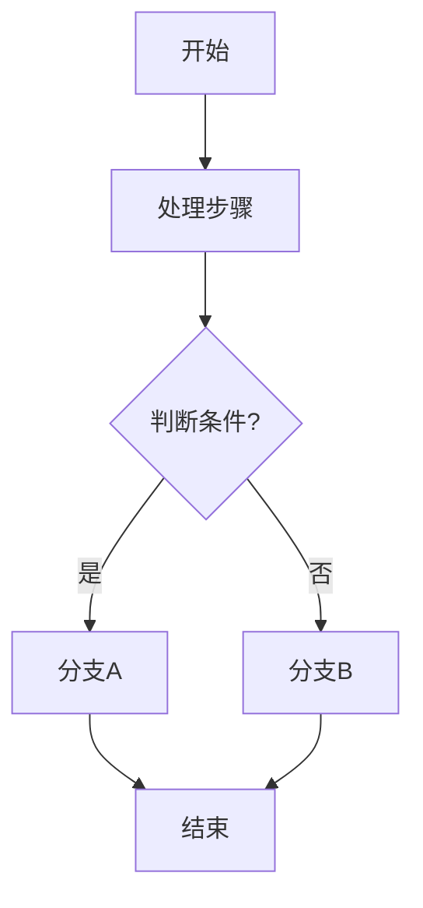
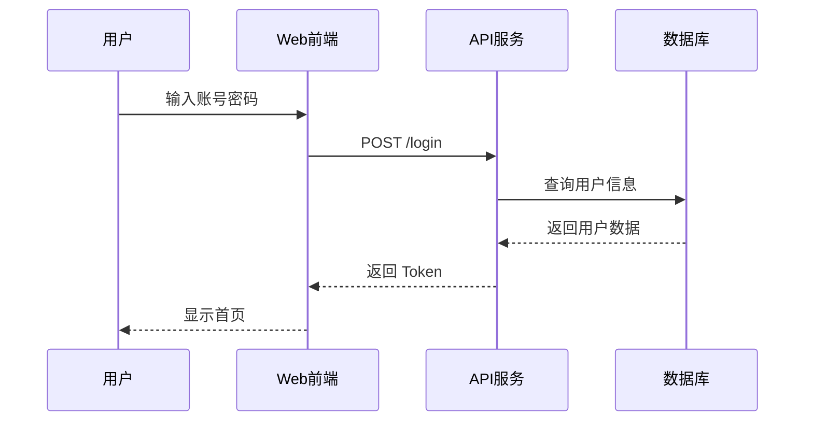
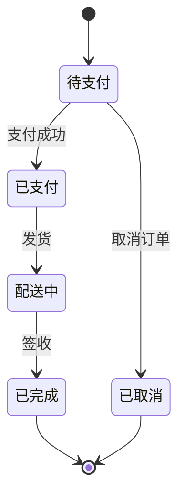
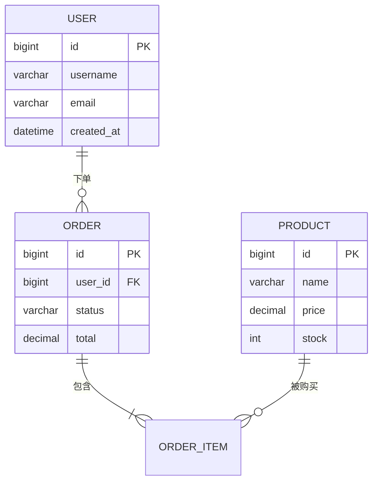
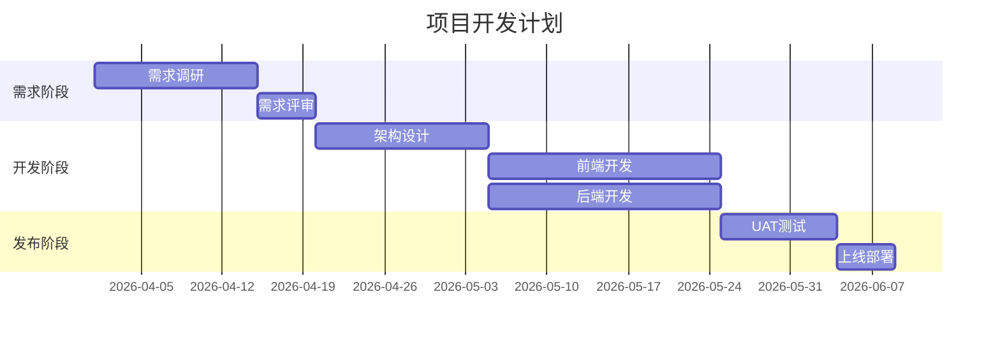
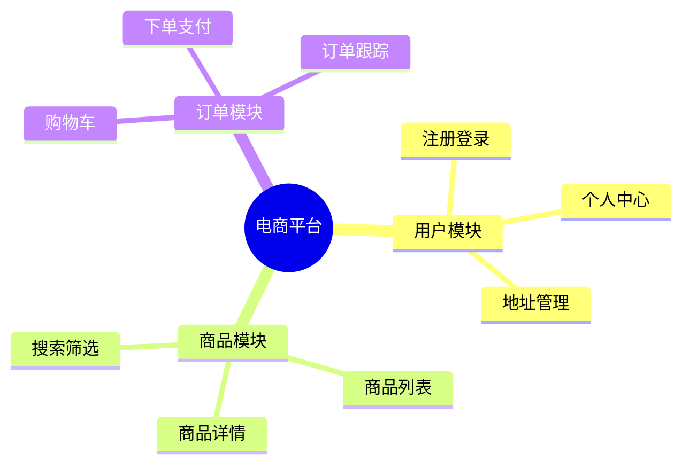

# Mermaid 图表语法参考

## 1. 图表类型选择

| 场景 | Mermaid 图表类型 |
|------|-----------------|
| 业务流程、决策流程 | `flowchart` |
| 接口调用、交互流程 | `sequenceDiagram` |
| 状态流转、生命周期 | `stateDiagram` |
| 数据模型、表关系 | `erDiagram` |
| 项目计划、时间线 | `gantt` |
| 知识结构、功能分解 | `mindmap` |

**注意：** 系统架构图、网络拓扑图使用 Canvas 原生绘制，不使用 Mermaid。

---

## 2. 流程图 (flowchart)

### 语法模板



### 节点形状

| 语法 | 形状 | 示例 |
|------|------|------|
| `id[文字]` | 矩形 | `[处理步骤]` |
| `id(文字)` | 圆角矩形 | `(开始)` |
| `id{文字}` | 菱形 | `{判断?}` |
| `id[[文字]]` | 子程序 | `[[子流程]]` |
| `id[(文字)]` | 圆柱 | `[(数据库)]` |

### 连线类型

| 语法 | 效果 |
|------|------|
| `-->` | 实线箭头 |
| `---` | 实线无箭头 |
| `-.->` | 虚线箭头 |
| `==>` | 粗线箭头 |
| `--文字-->` | 带标签连线 |

---

## 3. 时序图 (sequenceDiagram)

### 语法模板



### 箭头类型

| 语法 | 效果 |
|------|------|
| `->>` | 实线箭头 |
| `-->>` | 虚线箭头 |
| `-) ` | 异步箭头 |
| `--x` | 失败返回 |

---

## 4. 状态图 (stateDiagram)

### 语法模板



---

## 5. ER 图 (erDiagram)

### 语法模板



### 关系符号

| 符号 | 关系 |
|------|------|
| `||--||` | 一对一 |
| `||--o{` | 一对多 |
| `}o--o{` | 多对多 |

---

## 6. 甘特图 (gantt)

### 语法模板



---

## 7. 思维导图 (mindmap)

### 语法模板



---

## 8. Canvas 原生绘制场景

当以下场景不适合 Mermaid 时，使用 Canvas 原生绘制：

| 场景 | 原因 |
|------|------|
| 系统架构图 | 需要精确控制节点位置、分组、连接样式 |
| 网络拓扑图 | 需要自定义图标、复杂的连接关系 |
| 蓝图设计 | 需要精确的尺寸和比例 |

### Canvas 模板

```html
<div class="canvas-blueprint">
  <span class="canvas-blueprint-title">系统架构图</span>
  <canvas id="blueprint-1"></canvas>
</div>

<script>
(function() {
  const canvas = document.getElementById('blueprint-1');
  const ctx = canvas.getContext('2d');
  // 设置画布尺寸
  canvas.width = canvas.parentElement.offsetWidth;
  canvas.height = 400;

  // 绘制逻辑
  // ... 自定义绘制代码

  // 响应窗口大小变化
  window.addEventListener('resize', () => {
    canvas.width = canvas.parentElement.offsetWidth;
    // 重绘
  });
})();
</script>
```

---

## 9. 禁止事项

- ❌ 使用 `<pre>` 包裹 Mermaid 代码
- ❌ 保留 ASCII 字符图表
- ❌ 为简单图表使用 Canvas（优先 Mermaid）

## 10. 推荐做法

- ✅ 使用 `<div class="diagram-container"><pre class="mermaid">` 包裹 Mermaid 代码
- ✅ 为架构图使用 Canvas 原生绘制
- ✅ 保持图表简洁，避免过度复杂