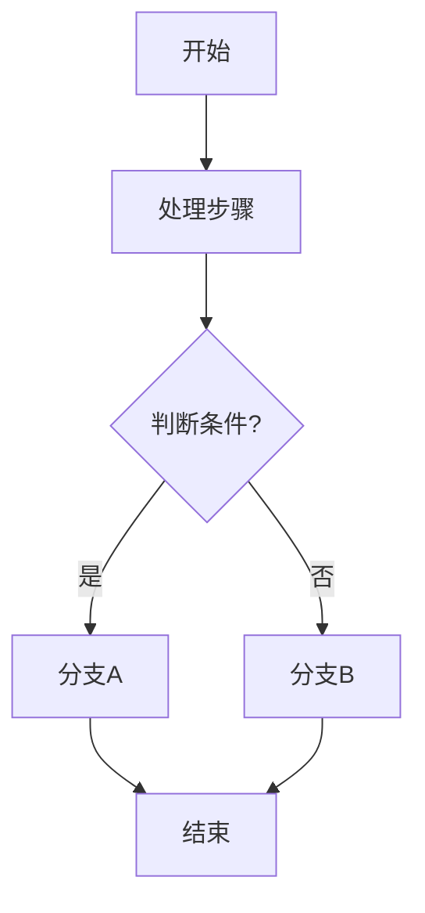
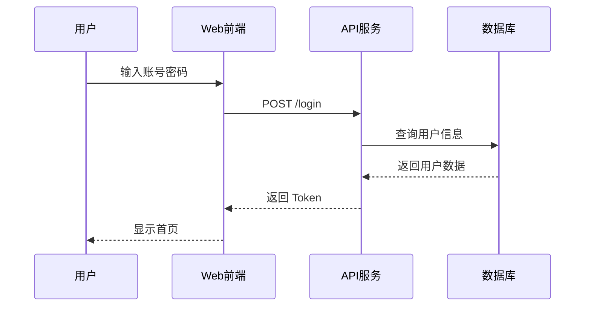
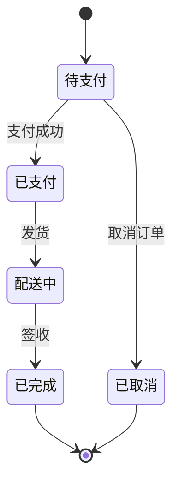
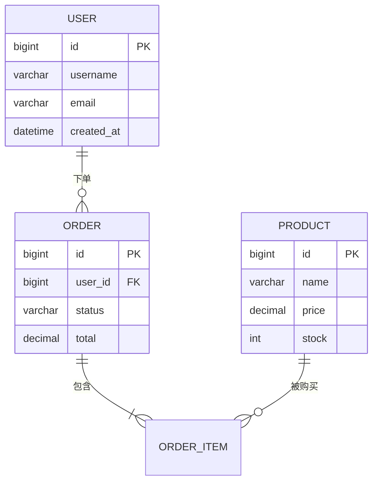
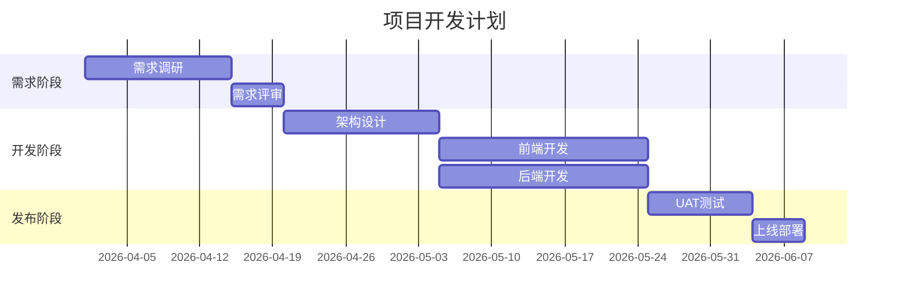
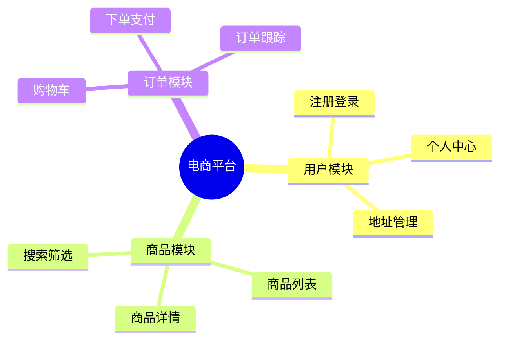
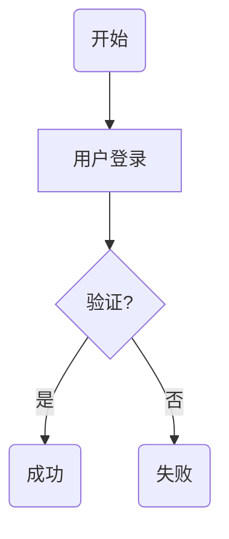

# Mermaid 图表语法参考

## 1. 图表类型选择

| 场景 | Mermaid 图表类型 |
|------|-----------------|
| 业务流程、决策流程 | `flowchart` |
| 接口调用、交互流程 | `sequenceDiagram` |
| 状态流转、生命周期 | `stateDiagram` |
| 数据模型、表关系 | `erDiagram` |
| 项目计划、时间线 | `gantt` |
| 知识结构、功能分解 | `mindmap` |

**注意：** 系统架构图、网络拓扑图使用 Canvas 原生绘制，不使用 Mermaid。

---

## 2. 流程图 (flowchart)

### 语法模板



### 节点形状

| 语法 | 形状 | 示例 |
|------|------|------|
| `id[文字]` | 矩形 | `[处理步骤]` |
| `id(文字)` | 圆角矩形 | `(开始)` |
| `id{文字}` | 菱形 | `{判断?}` |
| `id[[文字]]` | 子程序 | `[[子流程]]` |
| `id[(文字)]` | 圆柱 | `[(数据库)]` |

### 连线类型

| 语法 | 效果 |
|------|------|
| `-->` | 实线箭头 |
| `---` | 实线无箭头 |
| `-.->` | 虚线箭头 |
| `==>` | 粗线箭头 |
| `--文字-->` | 带标签连线 |

---

## 3. 时序图 (sequenceDiagram)

### 语法模板



### 箭头类型

| 语法 | 效果 |
|------|------|
| `->>` | 实线箭头 |
| `-->>` | 虚线箭头 |
| `-) ` | 异步箭头 |
| `--x` | 失败返回 |

---

## 4. 状态图 (stateDiagram)

### 语法模板



---

## 5. ER 图 (erDiagram)

### 语法模板



### 关系符号

| 符号 | 关系 |
|------|------|
| `||--||` | 一对一 |
| `||--o{` | 一对多 |
| `}o--o{` | 多对多 |

---

## 6. 甘特图 (gantt)

### 语法模板



---

## 7. 思维导图 (mindmap)

### 语法模板



---

## 8. Canvas 原生绘制场景

当以下场景不适合 Mermaid 时，使用 Canvas 原生绘制：

| 场景 | 原因 |
|------|------|
| 系统架构图 | 需要精确控制节点位置、分组、连接样式 |
| 网络拓扑图 | 需要自定义图标、复杂的连接关系 |
| 蓝图设计 | 需要精确的尺寸和比例 |

### Canvas 模板

**⚠️ 关键要求：画布尺寸必须根据内容动态计算，避免内容被裁剪**

```html
<div class="canvas-blueprint-wrapper">
  <div class="canvas-blueprint">
    <span class="canvas-blueprint-title">系统架构图</span>
    <canvas id="blueprint-1"></canvas>
  </div>
</div>

<script>
(function() {
  const canvas = document.getElementById('blueprint-1');
  const ctx = canvas.getContext('2d');

  // ===== 颜色配置（从 CSS 变量读取） =====
  const styles = getComputedStyle(document.documentElement);
  const colors = {
    foreground: styles.getPropertyValue('--foreground').trim() || '#0f172a',
    primary: styles.getPropertyValue('--primary').trim() || '#3b82f6',
    border: styles.getPropertyValue('--border').trim() || '#e2e8f0',
    muted: styles.getPropertyValue('--muted-foreground').trim() || '#64748b'
  };

  // ===== 定义节点数据 =====
  const nodes = [
    { id: 'node1', x: 100, y: 80, width: 140, height: 60, label: '前端应用', type: 'primary' },
    { id: 'node2', x: 100, y: 180, width: 140, height: 60, label: 'API 网关', type: 'secondary' },
  ];

  const connections = [
    { from: 'node1', to: 'node2', label: 'HTTP' },
  ];

  // ===== 计算内容边界 =====
  function calculateContentBounds() {
    let maxX = 0, maxY = 0;
    const padding = 40;
    nodes.forEach(node => {
      maxX = Math.max(maxX, node.x + node.width);
      maxY = Math.max(maxY, node.y + node.height);
    });
    return {
      width: Math.max(400, maxX + padding),
      height: Math.max(200, maxY + padding)
    };
  }

  // ===== Retina 屏幕适配 =====
  function setupCanvas() {
    const bounds = calculateContentBounds();
    const dpr = window.devicePixelRatio || 1;

    canvas.width = bounds.width * dpr;
    canvas.height = bounds.height * dpr;
    canvas.style.width = bounds.width + 'px';
    canvas.style.height = bounds.height + 'px';

    ctx.scale(dpr, dpr);
    ctx.imageSmoothingEnabled = true;
    ctx.imageSmoothingQuality = 'high';

    draw();
  }

  // ===== 绘制圆角矩形（含兼容性回退） =====
  function drawRoundedRect(x, y, width, height, radius) {
    if (ctx.roundRect) {
      ctx.beginPath();
      ctx.roundRect(x, y, width, height, radius);
      return;
    }
    ctx.beginPath();
    ctx.moveTo(x + radius, y);
    ctx.arcTo(x + width, y, x + width, y + height, radius);
    ctx.arcTo(x + width, y + height, x, y + height, radius);
    ctx.arcTo(x, y + height, x, y, radius);
    ctx.arcTo(x, y, x + width, y, radius);
    ctx.closePath();
  }

  // ===== 绘制节点 =====
  function drawNode(node) {
    const typeColors = {
      primary: { fill: colors.primary, text: '#ffffff' },
      secondary: { fill: '#8b5cf6', text: '#ffffff' },
      tertiary: { fill: '#10b981', text: '#ffffff' }
    };
    const color = typeColors[node.type] || typeColors.primary;

    drawRoundedRect(node.x, node.y, node.width, node.height, 8);
    ctx.fillStyle = color.fill;
    ctx.fill();

    ctx.fillStyle = color.text;
    ctx.font = '500 14px Inter, sans-serif';
    ctx.textAlign = 'center';
    ctx.textBaseline = 'middle';
    ctx.fillText(node.label, node.x + node.width / 2, node.y + node.height / 2);
  }

  // ===== 绘制连接线 =====
  function drawConnection(from, to, label) {
    const startX = from.x + from.width / 2;
    const startY = from.y + from.height;
    const endX = to.x + to.width / 2;
    const endY = to.y;

    ctx.beginPath();
    ctx.moveTo(startX, startY);
    ctx.lineTo(endX, endY);
    ctx.strokeStyle = colors.muted;
    ctx.lineWidth = 2;
    ctx.stroke();

    const arrowSize = 8;
    ctx.beginPath();
    ctx.moveTo(endX, endY);
    ctx.lineTo(endX - arrowSize, endY - arrowSize);
    ctx.lineTo(endX + arrowSize, endY - arrowSize);
    ctx.closePath();
    ctx.fillStyle = colors.muted;
    ctx.fill();

    if (label) {
      ctx.fillStyle = colors.muted;
      ctx.font = '12px Inter, sans-serif';
      ctx.fillText(label, (startX + endX) / 2, (startY + endY) / 2 - 10);
    }
  }

  // ===== 主绘制函数 =====
  function draw() {
    const bounds = calculateContentBounds();
    ctx.clearRect(0, 0, bounds.width, bounds.height);

    connections.forEach(conn => {
      const from = nodes.find(n => n.id === conn.from);
      const to = nodes.find(n => n.id === conn.to);
      drawConnection(from, to, conn.label);
    });

    nodes.forEach(node => drawNode(node));
  }

  setupCanvas();
  window.addEventListener('resize', setupCanvas);
})();
</script>
```

**Canvas 绘制核心原则：**

| 要求 | 说明 |
|------|------|
| Retina 适配 | 使用 `devicePixelRatio` 缩放画布 |
| 颜色变量 | 从 CSS 变量读取，提供 fallback |
| 动态尺寸 | 根据内容计算，不硬编码高度 |
| roundRect 兼容 | 提供 arcTo 回退方案 |

---

## 9. 禁止事项

- ❌ 使用 `<pre>` 包裹 Mermaid 代码
- ❌ 保留 ASCII 字符图表
- ❌ 为简单图表使用 Canvas（优先 Mermaid）

## 10. 推荐做法

- ✅ 使用 `<div class="diagram-container"><pre class="mermaid">` 包裹 Mermaid 代码
- ✅ Mermaid 图图不添加额外标题（折叠面板标题已提供）
- ✅ 为架构图使用 Canvas 原生绘制
- ✅ 保持图表简洁，避免过度复杂

---

## 11. ASCII 图表识别模式

| 图表类型 | ASCII 特征 | 转换目标 |
|---------|-----------|----------|
| 流程图 | `┌─────┐` `│  A  │` `└──┬──┘` `▼` `►` | Mermaid flowchart |
| 架构图 | 多层结构，`──` 连接线，分层标签 | Canvas 原生绘制 |
| 时序图 | 垂直时间线，`->>` 箭头 | Mermaid sequenceDiagram |
| 状态图 | `[*]` `-->` 状态转换 | Mermaid stateDiagram |
| 决策树 | `├─` `└─` `│` 树形结构 | Mermaid flowchart |

### ASCII 识别字符

```
检测以下字符模式：
- 框线字符: ┌ ┐ └ ┘ ├ ┤ ┬ ┴ ┼
- 线条字符: │ ─ ═
- 箭头字符: ► ▼ ▲ → ← ↑ ↓
- 连接符: ┌───┐ 形式的矩形框
```

### 节点类型映射

| ASCII 图形 | Mermaid 语法 | 样式特征 |
|-----------|-------------|----------|
| 圆角矩形（开始/结束） | `id(文字)` | 圆角矩形 |
| 矩形（处理步骤） | `id[文字]` | 矩形 |
| 菱形（判断条件） | `id{文字}` | 菱形 |

### Lucide 图标映射（Canvas/HTML）

| 场景 | 图标 |
|------|------|
| 开始 | `play-circle` |
| 结束 | `stop-circle` |
| 处理步骤 | `cog` 或文本 |
| 判断 | `help-circle` |
| 用户操作 | `user` |
| 数据库 | `database` |
| API/服务 | `server` |
| 前端 | `monitor` |
| 移动端 | `smartphone` |
| 缓存 | `hard-drive` |
| 外部服务 | `cloud` |

---

## 12. ASCII 转 Mermaid 示例

### 原始 ASCII 图

```
┌─────────────┐
│    开始     │
└──────┬──────┘
       │
       ▼
┌─────────────┐
│  用户登录   │
└──────┬──────┘
       │
       ▼
   ┌───┴───┐
   │ 验证? │
   └───┬───┘
    是 │   否
   ┌───┴───┐
   ▼       ▼
┌─────┐ ┌─────┐
│成功 │ │失败 │
└─────┘ └─────┘
```

### 转换后 Mermaid

