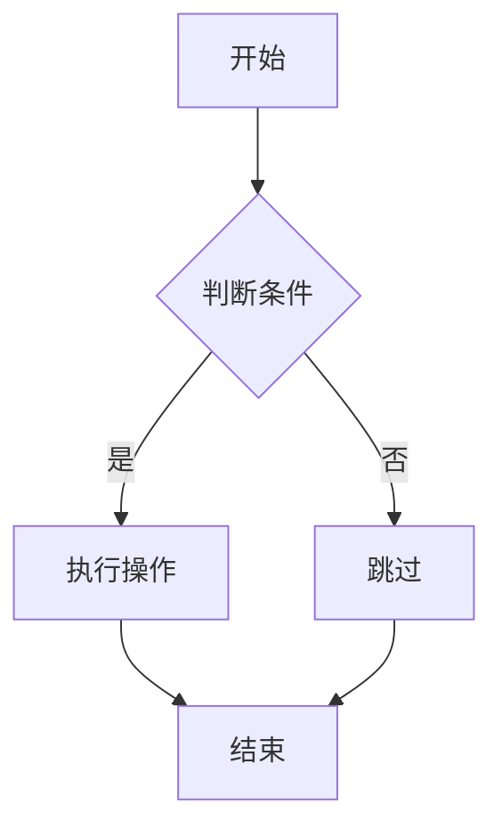
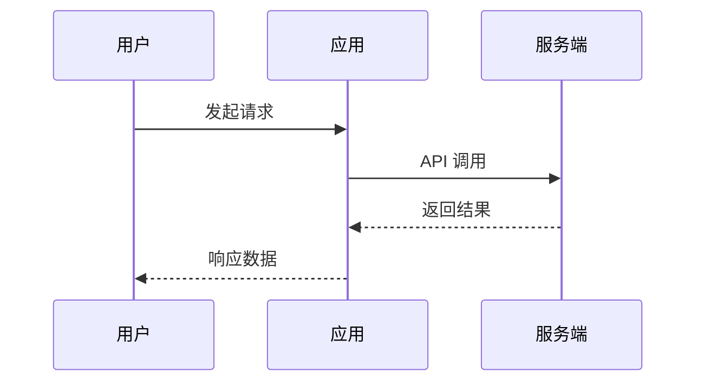
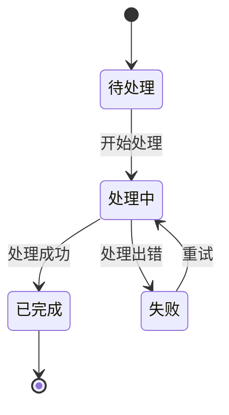
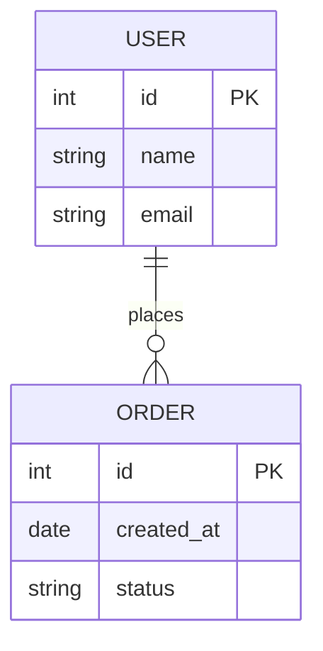

# 图表渲染选择规范

本文档定义如何选择合适的图表渲染方式：Mermaid、HTML/CSS 或 Canvas。

---

## 渲染方式决策树

```
需要可视化关系/流程？
│
├─ 图表类型判断
│   │
│   ├─ 流程图/时序图/状态图/ER图？
│   │   └─ 节点数 ≤ 10 → Mermaid
│   │   └─ 节点数 > 10 → HTML 绘制
│   │
│   ├─ 架构图/蓝图/系统设计图？
│   │   └─ HTML 绘制（使用 architecture-diagram.html）
│   │
│   ├─ 数据图表（统计/趋势/占比）？
│   │   └─ Chart.js（参见 chart-specs.md）
│   │
│   └─ 简单流程展示？
│       └─ 步骤 ≤ 5 → HTML 绘制（使用 flowchart.html）
│       └─ 步骤 > 5 → Mermaid
│
└─ 节点数 > 15 且关系复杂？
    └─ 考虑 Canvas（需评估交互需求）
```

---

## 渲染方式对比表

| 特性 | Mermaid | HTML/CSS | Canvas |
|------|---------|----------|--------|
| **适用场景** | 标准图表类型 | 架构图、复杂流程 | 大型动态图表 |
| **节点数限制** | 建议 ≤ 10 | 无硬限制 | 无限制 |
| **关系复杂度** | 擅长多连线/交叉 | 擅长层级关系 | 任意复杂度 |
| **样式控制** | 有限（主题配置） | 完全可控 | 完全可控 |
| **交互能力** | 基础（缩放/点击） | 丰富（悬停/动画） | 需自行实现 |
| **开发效率** | 高（声明式） | 中（模板复用） | 低（手写逻辑） |
| **性能** | 中（渲染引擎） | 高（浏览器优化） | 高（GPU加速） |
| **可访问性** | 好（文本备用） | 好（语义化） | 差（需额外处理） |
| **响应式** | 自动适配 | CSS 控制 | 手动适配 |

---

## 具体场景选择

### 流程图（Flowchart）

| 条件 | 渲染方式 | 说明 |
|------|---------|------|
| 节点 ≤ 5，线性流程 | HTML（flowchart.html） | 视觉精美，易于定制 |
| 节点 6-10，简单分支 | Mermaid | 关系表达清晰 |
| 节点 > 10，多分支 | HTML（flowchart.html） | 拆分子流程或 HTML |
| 节点 > 15，复杂嵌套 | Canvas | 评估是否需要动态交互 |

**Mermaid 示例：**


**HTML 示例：** 使用 `templates/components/flowchart.html`

---

### 架构图（Architecture）

| 条件 | 渲染方式 | 模板 |
|------|---------|------|
| 分层架构（3-5 层） | HTML | `architecture-diagram.html` |
| 微服务架构 | HTML | `architecture-diagram.html` |
| 数据流图 | HTML | `flowchart.html` 或 Mermaid |
| 网络拓扑图 | HTML | `architecture-diagram.html` |

**HTML 架构图特点：**
- 支持多种节点类型：`primary`, `secondary`, `database`, `cache`, `external`
- 层级结构清晰，适合展示系统分层
- 支持悬停效果和视觉交互

---

### 大型图表选择指南

```
节点数评估
│
├─ ≤ 10 节点
│   └─ 优先 Mermaid（开发效率高）
│
├─ 11-15 节点
│   ├─ 关系简单（线性/树形） → HTML 绘制
│   └─ 关系复杂（网状/多交叉） → Mermaid + 拆分
│
├─ 16-30 节点
│   └─ HTML 绘制（使用现有模板）
│
└─ > 30 节点
    ├─ 静态展示 → HTML + 拆分为多个子图
    └─ 需要交互（缩放/拖拽/筛选） → Canvas
```

**Canvas 使用警告：** 仅在 HTML 无法满足时使用。Canvas 需要额外处理：
- 无障碍访问（ARIA 标签）
- 响应式适配
- 文本选择支持

---

### 时序图（Sequence Diagram）

| 条件 | 渲染方式 | 说明 |
|------|---------|------|
| 参与者 ≤ 5 | Mermaid | 标准 `sequenceDiagram` |
| 参与者 6-8 | Mermaid | 注意布局宽度 |
| 参与者 > 8 | 拆分 | 按模块拆分为多个时序图 |

**示例：**


---

### 状态图（State Diagram）

| 条件 | 渲染方式 | 说明 |
|------|---------|------|
| 状态 ≤ 6 | Mermaid | 使用 `stateDiagram-v2` |
| 状态 7-10 | Mermaid | 评估是否需要简化 |
| 状态 > 10 | HTML | 使用流程图模板或拆分 |

**示例：**


---

### ER 图（Entity Relationship）

| 条件 | 渲染方式 | 说明 |
|------|---------|------|
| 实体 ≤ 6 | Mermaid | 使用 `erDiagram` |
| 实体 7-8 | Mermaid | 注意布局密度 |
| 实体 > 8 | 拆分 | 按业务域拆分为多个 ER 图 |

**示例：**


---

## 禁止事项

### 严格禁止

| 禁止行为 | 原因 | 替代方案 |
|---------|------|---------|
| 使用 ASCII/字符串绘制图表 | 渲染效果差、无交互 | Mermaid 或 HTML |
| 节点数 > 15 时使用 Mermaid | 布局混乱、性能下降 | HTML 绘制或拆分 |
| 简单流程图使用 Canvas | 开发成本高、维护困难 | HTML（flowchart.html） |

### 不推荐

| 行为 | 问题 | 建议 |
|------|------|------|
| 单页面超过 4 个 Mermaid 图 | 渲染性能影响 | 合并或拆分页面 |
| Mermaid 图无文本备用 | 可访问性问题 | 添加 `<pre>` 备用文本 |
| HTML 图无响应式处理 | 移动端显示问题 | 添加 `overflow-x: auto` |

---

## 代码示例

### Mermaid 渲染

```html
<!-- Mermaid 基础结构 -->
<div class="mermaid-card">
  <div class="mermaid-header">
    <h4>流程图标题</h4>
  </div>
  <div class="mermaid-content">
    <pre class="mermaid">
flowchart TD
    A[开始] --> B{判断}
    B --> C[结束]
    </pre>
  </div>
</div>

<!-- Mermaid 初始化 -->
<script src="https://cdn.jsdelivr.net/npm/mermaid/dist/mermaid.min.js"></script>
<script>
  mermaid.initialize({
    startOnLoad: true,
    theme: 'default' // 或 'dark'
  });
</script>
```

### HTML 绘制流程图

```html
<!-- 使用 flowchart.html 模板 -->
<div class="flowchart-container">
  <div class="flow-title">用户认证流程</div>
  <div class="flowchart">
    <div class="flow-row">
      <div class="flow-node" data-type="start">开始</div>
    </div>
    <div class="flow-arrow"><i data-lucide="arrow-down"></i></div>
    <div class="flow-row">
      <div class="flow-node" data-type="process">用户输入凭证</div>
    </div>
    <div class="flow-arrow"><i data-lucide="arrow-down"></i></div>
    <div class="flow-row">
      <div class="flow-node" data-type="decision">验证通过?</div>
    </div>
    <div class="flow-arrow"><i data-lucide="arrow-down"></i></div>
    <div class="flow-row">
      <div class="flow-node" data-type="end">认证成功</div>
    </div>
  </div>
</div>
```

### HTML 绘制架构图

```html
<!-- 使用 architecture-diagram.html 模板 -->
<div class="architecture-diagram">
  <div class="arch-title">系统架构</div>
  <div class="arch-layers">
    <div class="arch-layer">
      <div class="layer-label">前端层</div>
      <div class="layer-nodes">
        <div class="arch-node" data-type="primary">
          <i data-lucide="monitor"></i>
          <span>Web 应用</span>
        </div>
        <div class="arch-node" data-type="secondary">
          <i data-lucide="smartphone"></i>
          <span>移动端</span>
        </div>
      </div>
    </div>
    <div class="arch-connector"><i data-lucide="arrow-down"></i></div>
    <div class="arch-layer">
      <div class="layer-label">服务层</div>
      <div class="layer-nodes">
        <div class="arch-node" data-type="primary">
          <i data-lucide="server"></i>
          <span>API 网关</span>
        </div>
        <div class="arch-node" data-type="database">
          <i data-lucide="database"></i>
          <span>数据库</span>
        </div>
      </div>
    </div>
  </div>
</div>
```

---

## 相关参考

| 文件 | 用途 |
|------|------|
| `mermaid-specs.md` | Mermaid 详细语法和限制 |
| `chart-specs.md` | Chart.js 数据图表选择 |
| `icon-system.md` | Lucide 图标映射表 |
| `templates/components/flowchart.html` | HTML 流程图模板 |
| `templates/components/architecture-diagram.html` | HTML 架构图模板 |

---

## 快速决策检查表

- [ ] 确认图表类型（流程/架构/数据/状态/ER）
- [ ] 统计节点数量
- [ ] 评估关系复杂度（线性/树形/网状）
- [ ] 确认交互需求（静态/悬停/动态）
- [ ] 选择渲染方式
- [ ] 检查是否违反禁止事项