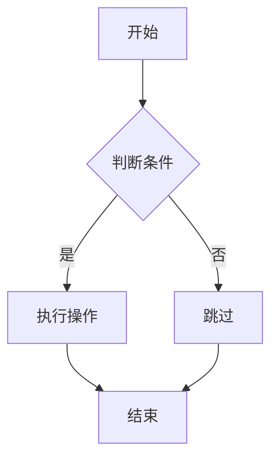
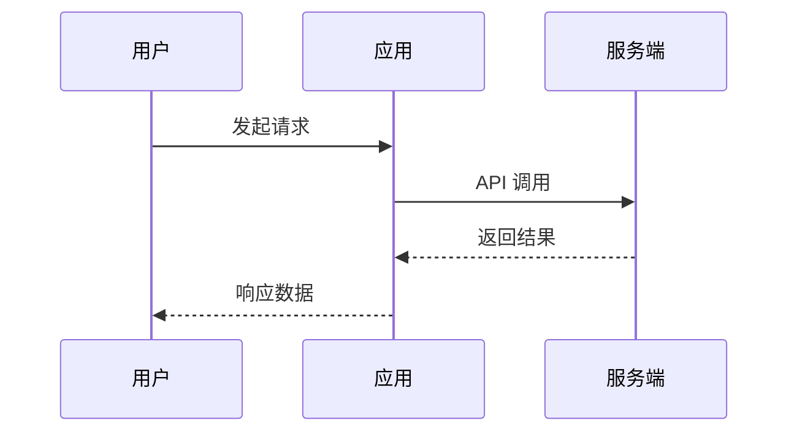
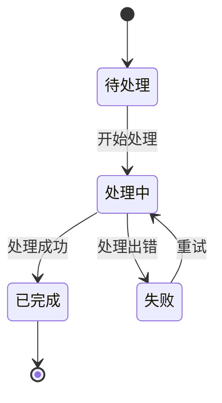
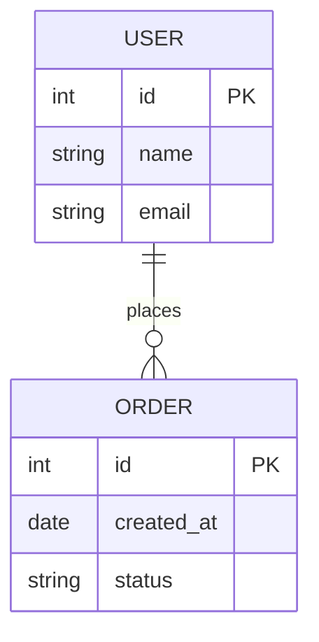

# Mermaid 图表规范

本文档定义 Mermaid 图表的使用场景、限制规则和推荐结构。

---

## 适用场景

### 优先使用 Mermaid

| 场景 | Mermaid 类型 | 示例 |
|-----|-------------|------|
| 简单流程 | `flowchart TD/LR` | 3-5 步骤流程 |
| 时序交互 | `sequenceDiagram` | API 调用链、用户操作序列 |
| 状态转换 | `stateDiagram-v2` | 订单状态、审批流程 |
| 实体关系 | `erDiagram` | 简单 ER 图（≤ 8 表） |
| 类图 | `classDiagram` | 简单类结构 |
| 甘特图 | `gantt` | 项目时间线 |

### 使用限制

- **节点数建议 ≤ 10 个**
- 超过限制时，拆分为多个子图或改用 HTML 绘制
- 复杂架构图禁用 Mermaid，改用 HTML + CSS 绘制

---

## 渲染方式选择

### 重要规则

| 规则 | 说明 |
|-----|------|
| **禁止使用字符串/ASCII 绘制图表** | 所有图表必须使用 Mermaid 或 HTML 模板渲染，严禁手绘 ASCII 或字符串图表 |
| **节点数限制** | Mermaid 节点数建议 ≤ 10 个；超过时拆分为多个子图或改用 HTML 模板 |
| **架构图禁用 Mermaid** | 大型架构图必须使用 HTML 绘制，推荐使用 `architecture-diagram.html` 模板 |

### 场景判断

| 场景特征 | 渲染方式 | 原因 |
|---------|---------|------|
| 小型图表（节点 ≤ 10） | Mermaid | 轻量、关系表达清晰 |
| 节点简单、关系复杂（多连线/交叉） | Mermaid | Mermaid 擅长表达复杂关系 |
| 大型蓝图、架构图（节点 > 10） | HTML 绘制 | 更直观、精美、可控 |
| 复杂流程图（多分支/嵌套） | HTML 绘制 | 布局灵活、交互性强 |

### 决策树

```
需要可视化关系/流程？
│
├─ 是否为大型架构图？
│   └─ 是 → 使用 HTML 模板（architecture-diagram.html）
│
├─ 节点数是否 > 10？
│   ├─ 是 → 可否拆分为多个子图？
│   │   ├─ 是 → 拆分后使用 Mermaid
│   │   └─ 否 → 使用 HTML 模板
│   │
│   └─ 否（节点 ≤ 10）
│       ├─ 关系复杂（多连线/交叉）→ Mermaid
│       └─ 简单流程 → Mermaid
│
└─ 禁止使用 ASCII/字符串绘图
    └─ 所有图表必须使用 Mermaid 或 HTML 模板
```

> 详细渲染决策逻辑参见 [diagram-rendering-spec.md](./diagram-rendering-spec.md)

---

## 组件结构

### Mermaid 卡片

```html
<div class="mermaid-card">
  <div class="mermaid-header">
    <h4>流程图</h4>
    <button class="zoom-btn">放大</button>
  </div>
  <div class="mermaid-content">
    <pre class="mermaid">graph TD...</pre>
  </div>
</div>
```

### 放大 Modal

支持点击放大查看复杂图表：

```html
<div class="mermaid-modal" hidden>
  <div class="modal-content">
    <pre class="mermaid"><!-- 放大内容 --></pre>
  </div>
</div>
```

---

## 图表类型示例

### 流程图（Flowchart）



### 时序图（Sequence Diagram）



### 状态图（State Diagram）



### ER 图（Entity Relationship）



---

## 主题适配

Mermaid 需要适配明暗主题，支持动态切换：

```javascript
// 初始化时获取当前主题
const currentTheme = document.documentElement.getAttribute('data-theme');
mermaid.initialize({
  startOnLoad: true,
  theme: currentTheme === 'dark' ? 'dark' : 'default'
});

// 主题切换时更新
function toggleTheme() {
  const newTheme = document.documentElement.getAttribute('data-theme') === 'dark' ? 'light' : 'dark';
  document.documentElement.setAttribute('data-theme', newTheme);

  mermaid.initialize({
    startOnLoad: false,
    theme: newTheme === 'dark' ? 'dark' : 'default'
  });
  mermaid.run();
}
```

### 基础主题切换函数

```javascript
function updateMermaidTheme(isDark) {
  mermaid.initialize({
    theme: isDark ? 'dark' : 'default'
  });
}
```

---

## 错误处理

当 Mermaid 图表节点数超过限制时：

```html
<!-- 节点数过多警告 -->
<div class="mermaid-warning">
  ⚠️ 此图表节点数超过10个，建议拆分或改用 HTML 绘制
</div>
```

---

## 相关参考

- 渲染决策流程 → 参见 [diagram-rendering-spec.md](./diagram-rendering-spec.md)
- 大型架构图、复杂流程图 → 参见 `component-specs.md` HTML 绘制图表
- 数据统计图表 → 参见 `chart-specs.md` Chart.js 图表